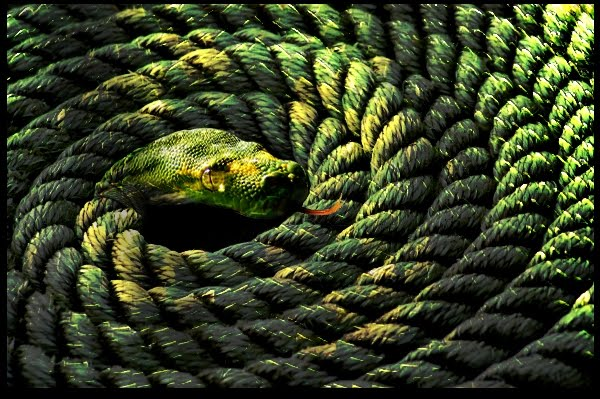

<!-- # set the overall width of the HTML page -->

Suppose you enter into a room, which is not totally dark but dimly lit. Upon entering, you see a snake lying on the floor. You get afraid and shout in panic. Groping on the wall, you switch on a bright light. Immediately you see, that's not a snake, but a piece of rope. Your fear vanishes.
  

&nbsp;

This is the rope-snake analogy, one of those few famous metaphors that are used to hint at the status of reality in the texts of Advaita (Non-dualistic or monistic) Vedanta. Advaita Vedanta is often simply called Advaita (অদ্বৈত). Below we will see how the rope-snake analogy illustrates the Advaita. 

First let us see the basic tenets of Advaita, in one way:

## Basics of Advaita

1. The Absolute or the Ultimate Reality is referred to by the word Brahman (ব্রহ্ম). The word Brahman literally just means what is big or vast. 

    a. Brahman is beyond mind (thoughts/concepts) and speech (words), or equivalently beyond space, time and causation.  

    b. The best intuition about Brahman is that Brahman is 'not this, not this' ("Neti Neti", "নেতি নেতি"). This means, Brahman is nothing that you can indicate (first Neti), also not that it is nothing (second Neti).  

    c. The best conceptual / verbal approximation using words is that Brahman is infinite existence-consciousness. ("Satyam Jnanam Anantam Brahman", "সত্যম্ জ্ঞানম্ অনন্তম্ ব্রহ্ম")  

    d. Because of being infinite, Brahman is the one and the only one (non-dual) having absolute reality.   

2. The world, that we see has no absolutely reality, but only an appearing (apparent) reality. That which is always real, no matter what, is called absolutely real (Sat or সৎ). That which is always unreal, no matter what, is called absolutely unreal (Asat or অসৎ). That which is sometimes real, sometimes unreal, is called apparently real (Mithya or মিথ্যা). An absolutely unreal thing has no apparent reality even, for example, human horns, or a square circle. The world is neither absolutely real, nor absolutely unreal, but apparently real. ("ব্রহ্ম সত্য জগৎ মিথ্যা")

3. Jeeva (জীব), which means the individualized soul or the highest reality within every individual is identical with Brahman. ("জীব ব্রহ্ম এব ন অপরঃ")

 
There exist a few classical metaphors that are used to give a hunch of the basics of the Advaita, such as the **rope-snake metaphor**, the **dream metaphor**, the **nacre-silver metaphor** etc. 

Remember that all these examples are just ways of intuition, not explanation, because Brahman is beyond mind and speech and hence explanation. So, these examples have their limitations, and there will always be points of view from which they will look incomplete. Also, some will work better than others to lead certain intuitions. 

In this writing, our focus will be only on the 'reality' / 'existence' aspect contained in point 2) above. We shall try to conceptualize the same by the help of the rope-snake analogy. 

There is a strong limitation of the rope-snake analogy, which is that it presents a picture where the observer (you) is separate from the snake / rope. For this writing, we will take it for granted and that will not hinder the understanding aimed at here. In a latter writing, we will use the dream analogy to overcome this limitation to some extent and thereby to understand the 'consciousness' aspect and point 3). 

### Understading Advaita using the rope-snake analogy

A metaphor is always dependent on the point of view and hence one-sided. One has to learn the metaphor along with the point of view. Likewise is the case of using the snake-rope metaphor to conceptualize Advaita. The metaphor has its limits and within those it works wonderfully.

The analogy between the rope-snake analogy and the Advaita is as follows:
  

**Seeing the rope as snake == Seeing the Brahman as world.**
      
Illusion / Mistake == Maya

Rope == Brahman,

Snake == World,

Light == Consciousness/Knowledge

Dim light == Lower Consciousness/Knowledge 

Bright light == Higher Consciousness/Knowledge

 

To understand deeply the significance of the analogy, we will analyze, one by one, several observations about the example. Analyzing each observation and applying to the analogous Advaita component will bring a unique light of understanding on point 2) above, and of Advaita in general. 

- **Observation 1. The rope is there:** First of all, there is a rope there. If there is no rope there to begin with, the snake would not even appear. The existence of the rope is absolutely necessary for the appearance of the snake.

  Apply this analysis to the Advaita concept. Brahman is. That is why the world is getting to even appear. That is why any experience is being possible.

- **Observation 2. You see something:** When you enter the room, you see something. It is not that you see nothing. In order to see something, there must at least be a little light in the room. The room was dimly lit and that is why you could see even something. If there would be no light at all, you won't see anything at all. 

  Now apply this analysis to the Advaita. This tells, we are indeed seeing/knowing something, be it a world or whatever. So, we are not absolutely ignorant. The reality is not completely covered to us, but only partially. This only partial covering makes even any perception possible, be it whatever. If reality would be totally covered, we won't even have any perception of the world.

  Actually during deep sleep or when we become unconscious for some reason, we see nothing. Consequently, we don't have any memory from deep sleep or unconsciousness. So, possibly(!) during deep sleep or unconsciousness, the reality is totally covered. Perhaps that is why sleep is called a tama or tamasik guna. However, there is much more to discuss regarding deep sleep. We can take up that in a later writing.

- **Observation 3. You really see a snake there:** You really see a snake, when you look there! It is not that you are trying to see the rope as a snake. The snake is very real to you at that point. And so also your fear is very real, as real as it would be if there were really a snake there.

  Think of another example where someone moves his hands in front of a lamp and projects shadows on the wall in such a way that you see an animal figure on the wall. There, you are seeing an animal on the wall, you are enjoying recognizing the shadow as an animal, but you are fully aware that that is not a real animal. 

  Such is, however, not the case in the rope-snake example. Here, you are seeing a snake literally. You have no awareness that it is actually a rope. So, even though the snake is not really real, the fear you will have from that sight is totally genuine. 

  Applying this analysis to the Advaita concept, when we are seeing the world, we are indeed seeing out there a world lying with its wordly ways. And our reactions to that experience are very genuine. Our worries, sufferings, enjoyments, likes, dislikes all are very genuine, as genuine as it can be.

- **Observation 4. The rope is absolutely real:** The rope is absolutely real. Absolutely real means always real, real before the mistake, real during the mistake, real when the mistake ends. Absolutely real may also be called really real or unconditionally real. 

  Before you have entered the room, the rope is there. During the mistake, the rope appears as a snake to you. However, the rope has not really become the snake. The rope is still the rope. At every moment of your mistaken perception, it is still a rope.  

  Also later when you would realize the mistake, you would not think that for a while the rope had actually turned into a snake and then turned back into rope. You would realize that the rope was always the rope. So, the rope retains its rope-ness at all time. Your mistaken snake perception does not change the rope-ness of the rope in any way. The rope is at all time absolutely untouched.

  Similarly, even though we see the Brahman as the world, Brahman is absolutely untouched and is always the Brahman and never becomes the world. Brahman just appears as the world because of Maya. However, Maya does not touch Brahman in any way.

- **Observation 5. The snake is apparently real:** The snake is not absolutely real, but apparently real or conditionally real. The condition is the sustenance of the mistake. 

  We cannot say that the snake is absolutely un-real because during the mistake what you are seeing is very much a snake, which hence has some kind of reality. Again, we cannot also say that the snake is absolutely real, because at that place there is no snake, only a rope! Also when the mistake is gone, you no more see the snake. 

  So the snake is neither absolutely real, nor absolutely unreal; that means the status of the snake cannot be expressed in absolute terms. However, using relational terms, it is said the snake is conditionally real, whereas the rope is absolutely real. The reality of the snake is conditional on occurrence of the mistake.

  Note the difference between the realities of the rope and snake. When mistake ends, the (apparent) reality of the snake ends too. But when mistake starts, the (absolute) reality of the rope does not end.

  In this way, in Advaita, the world has no absolute reality, but it is apparently real under the condition of Maya. The world is real for the time being, but disappears when the true knowledge dawns.

- **Observation 6. Mutual superimposition:** The existence of the rope proxies as the existence in the appearing snake. And the qualities of the snake are superimposed on that existence. So, the appearance is a combination of the existence of the rope and the qualities of the snake.

  If the rope were not there, the snake would not even appear. The appearance of the snake is possible only because there is something at that place to begin with. That something is appearing as a snake. So, the existence of the snake is, truly speaking, the existence of the rope. There is no existence of snake at that place. So, the existence must of the rope's.

  On the other hand, you see a snake, which means, the qualities of the rope is covered and in that place the qualities of a snake is being seen. So, the qualities of the snake is superimposed on the existence of the rope making the illusion possible.

  Likewise, the existence of the world is a borrowed existence, and is of Brahman. The qualities of the world, that is worldliness is superimposed on that existence of Brahman. This superimposition brings about the apparent reality of the world.

- **Observation 7. Reaction is inevitable until mistake ends:** As long as you are seeing a snake, you are going to react in some way or other. Whatever you do, grope or shout or stay alert, all of those are the result of an acknowledgement of a snake there, not kidding. 

  If you are a snake-charmer yourself, then by virtue of familiarity with snakes you may react through indifference to that sight. But even that indifference is a reaction of a genuine acknowledgement of a snake.

  In the same way, so long as we perceive world, we are going to react in worldly ways. Our reactions to different things, of course, may evolve with familiarity. But so long as our perception itself presents a world, we are, in some way or other, under the spell of worldliness.

- **Observation 8. The rope is not 'do'ing anything for or against the mistake:** Note that the rope is, as such, not doing anything to make the mistake occur. The rope is just being the rope, just existing if we may say so. However, the rope's be-ing is absolutely necessary to bring about the mistake of seeing a snake. The rope is the cause of the snake illusion just by virtue of its existence, but not in any other way.

  The rope is not doing anything to remove the mistake either. When the bright light comes, you see the rope. But the rope does not give you any hint. It is you, who comes to look better in the bright light and discovers the rope. 

  In the same way, Brahman does not 'do' anything to make the world appear. Neither does Brahman interfere in any way with the world with its goods and bads. Neither does Brahman help to remove Maya. Brahman is just be-ing Brahman, nothing else. But without that be-ing, Maya won't take place. Brahman can be called the cause of the world only because of Its existence, and not in any other way.

- **Observation 9. To end the mistake, only seeing clearly is necessary, doing anything else particularly is not necessary:** The mistake arises because of lack of clarity in seeing. So, the only thing necessary to remove the mistake is to see more clearly. Doing anything else, be it whatever, is only effective if that doing somehow helps to see more clearly. Be it any action, groping in the wall, or shouting for other's help, or leaving the room, or whatever, so long as that action does not help to see more clearly, it is inconsequential. No action is, as itself, necessary. Rather, any action that leads to better vision will seem to do the job.

  Similarly, to remove maya, no action, whatsoever, can be seen as necessary. Action is not the last word, it is the dawn of higher knowledge/consciousnes that is the only thing necessary. Any action that helps to bring that knowledge will seem to do the job.

- **Observation 10. When mistake starts, all of the snake comes at once, and when mistake breaks, all of the snake goes at once:** When the mistake starts, you see a snake at once. It is not like different properties of the snake appear gradually, and you then connect those together to see the snake. All of the defining qualities of the snake, that is, the whole of the snake with all snake properties, infinite in number from information point of view, appear all at once, for which you simply see a snake. Similarly, when you realize the mistake, at once you get the rope, it is not that mistakes associated with different parts/properties of the snake go one by one. The whole of the snake, with its infinite qualities if you will, just as you saw in the beginning, goes at once. Snake was the unit of illusion as it appeared, and the same unit disappears at once.

  In the same way, at the dawn of Maya the whole of the world, along with infinite properties and interconnectedness of its things, appear all at once. We might say first came nebulae, then stars, then planets etc., but from an even higher standpoint the whole world along with the idea of an endless temporal order and spatial order, along with the idea of evolution, all appeared at once. And even so, when Maya breaks all of these will disappear at once as well.

- **Observation 11. The snake experience problem is not solved finally, it is dissolved:** The problems associated with the snake experience like fear etc are not finally solved, as such. When the bright light turns on, it is not that the your fear of seeing that snake goes. What happens is actually more drastic. What happens is that you no more see a snake there, you realize there never is a snake there. The snake itself gets dissolved, and along with it the problem itself gets dissolved, leaving no need to solve any problem.

  In the same way, when spiritual ignorance is gone through enlightenment, the problem of worldliness is not solved as such. Rather seeing the world itself is gone. The world is dissolved and hence no more is any need to solve any problem.

  It is not that there is a real problem which is solved at enlightenment. Rather for an enlightened being, there never was any problem to begin with. Actually, according to Advaita, if there is any real problem, it can never go away. However, the problem of worldliness goes away at enlightenment, which shows that the problem is not real to begin with. So, as such, no real solution also takes place at enlightenment, just the appearance of the problem gets dissolved.

- **Observation 12. You can never see the snake and the rope together:** Either you see the snake, or you see the rope. You can never see them as equally real. Once your mistake is gone, the reality of the snake is gone for you. You can still try to see how the rope kind of looks like a snake like the example above where you see animals created by shadow on the wall, but you know for sure within that it is a rope. 

  In the same way, the Brahman and the world can never be equally real at the same time. As long as the worldview seems real, Brahman can not be real, one is not enlightened. For an enlightened person, Brahman is real, and the reality of the world, as such, is gone for ever.

 

The above points should help one to be familiar with the way of the Advaita ideas and intuitions. As mentioned before, this rope-snake example has limited scope and nicely illustrates certain aspects of Advaita. There can be questions which are valid but not useful, because they are not meant to be used for illustration. For example, one might ask: 'When you see the rope, how can you say that the rope is actually not an illusion? May be, the snake is actually real. You were seeing the real, and suddently you started to see the illusion of rope. Your fear disappeared but rather mistakenly. How can you refute this way of thinking?', and other such questions.

Also the above points are by no means exhaustive. I urge the readers to contemplate on this topic and suggest any other points of intuition they may come up with within the current context and scope.

$$\\[1in]$$

    

