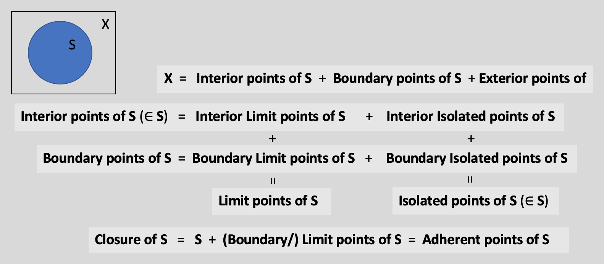

<!-- # set the overall width of the HTML page -->
<style type="text/css"> /* This sets the overall width of the HTML page */
  .main-container {
    /*max-width: 600px;   */
    margin-left: auto;
    margin-right: 10%;
  }
  body, td {
     font-size: 18px;
     /*font-family: Calibri;*/
     background: rgb(250,250,250);
  }
  code.r{                   /*for r code*/
    font-size: 16.5px;
  }
  pre {                 /*for output of knitr chunks*/
    font-size: 16.5px
    border: 0;
  }
  #TOC {
  color: purple;
  font-size: 15px; 
  }
  }
</style>

```{=latex}
\usepackage{amsmath}
```

<hr>

### Topological space

A <span style="color:purple;">topological space</span> is the most general type of a mathematical space that allows for the definition of limits, continuity, and connectedness. Euclidean spaces, metric spaces and manifolds are specializations of topological space. 

A <span style="color:purple;">topological space</span> is a set equipped with a mathematical structure called <span style="color:purple;">topology</span>. The elements of the set are called 'points'. There are two main and equivalent definitions of topology. Given any one, the other can be recovered. <br>

#### <u>Definition based on open sets</u>

***Using words:*** A topology on a set is a collection of subsets of the set, called <span style="color:purple;">open sets</span>, satisfying the following axioms.

i. The collection includes the empty set and the set itself.

ii. The collection is closed under arbitrary (finite or infinite) union.

iii. The collection is closed under finite intersection.

A subset of the set is defined to be a neighborhood of a point if the subset includes an open set containing the point.

***Using mathematical symbols:*** A topology on a set $X$ is a collection, $\tau$, of subsets of the set, called open sets, satisfying the following axioms.

i. $\tau$ includes the empty set and $X$ itself.

ii. $\tau$ is closed under arbitrary (finite or infinite) union.

iii. $\tau$ is closed under finite intersection.

$N \subseteq X$ is defined to be a neighborhood of $x$ if the $N$ includes an open set $U$ such that $x \in U$.

#### <u>Definition based on neighborhoods</u>

***Using words:*** [Hausdorff] A (neighborhood) topology on a set is a function that assigns to each point of the set a non-empty collection of subsets of the set, each element of the collection being called a <span style="color:purple;">neighborhood</span> of the point, satisfying the following axioms.

i. Each point itself belongs to every one of its neighborhoods.

ii. Every superset of the neighborhood of a point in the set is again a neighborhood of the point.

iii. The intersection of two neighborhoods of a point is a neighborhood of the point.

iv. Any neighboorhood of a point contains a neighborhood of the point such that the first neighborhood is a neighborhood of each point of the second neighborhood.

A subset of the set is defined to be open if the subset is a neighborhood of each of its points.

***Using mathematical symbols:*** [Hausdorff] A (neighborhood) topology on a set $X$ is a function $\mathcal{N}$ that assigns to each point $x$ of $X$ a non-empty collection $\mathcal{N}(x)$ of subsets of $X$, each element of $\mathcal{N}(x)$ being called a <span style="color:purple;">neighborhood</span> of $x$, satisfying the following axioms.

i. If $N \in \mathcal{N}(x)$, then $x \in N$.

ii. If $N \in \mathcal{N}(x)$, $M \subseteq X$ and $M \supseteq N$, then $M \in \mathcal{N}(x)$.

iii. If $N \in \mathcal{N}(x)$ and $M \in \mathcal{N}(x)$, then $N\cap M \in \mathcal{N}(x)$.

iv. If $N \in \mathcal{N}(x)$, there exists $M \subseteq N$ such that $M \in \mathcal{N}(x)$ and for each $y \in M$, $N \in \mathcal{N}(y)$.

$U \subseteq X$ is defined to be open if for all $x \in U$, $U \in \mathcal{N}(x)$.

$$\\[0.1in]$$


### Interior point, Interior

***Using words:*** <br>
[Open sets definition] An <span style="color:purple;">interior point</span> of a set is a point that is included in some open set contained in the set.

[Neighborhoods definition] A point is an <span style="color:purple;">interior point</span> of a set if the set is a neighborhood of that point.

The collection of all interior points of a set is called the <span style="color:purple;">interior</span> of the set.

***Using mathematical symbols:***<br>
[Open sets definition] An <span style="color:purple;">interior point</span> $x$ of a set $S$ is a point that is included in some open set contained in $S$.

[Neighborhoods definition] A point $x$ is an <span style="color:purple;">interior point</span> of $S$ if $S \in \mathcal{N}(x)$.

The collection of all interior points of a set $S$ is called the <span style="color:purple;">interior</span> of $S$.

{width=95%} 

$$\\[0.1in]$$


### Boundary point, boundary

***Using words:*** <br>
[Open sets definition] A <span style="color:purple;">boundary point</span> of a set is a point that is neither included in any open set contained in the set, nor included in any open set contained in the complement of the set.

[Neighborhoods definition] A <span style="color:purple;">boundary point</span> of a set is a point, any neighborhood of which contains some point of the set and some point of the complement of the set. 

The collection of all boundary points of a set is called the <span style="color:purple;">boundary</span> of the set.

***Using mathematical symbols:***<br>
[Open sets definition] A <span style="color:purple;">boundary point</span> $x$ of a set $S$ is a point that is neither included in any open set contained in $S$, nor included in any open set contained in $S^C$.

[Neighborhoods definition] A <span style="color:purple;">boundary point</span> $x$ of a set $S$ is a point such that for all $N \in \mathcal{N}(x)$, $N \cap S \neq \emptyset$ and $N \cap S^C \neq \emptyset$. 

The collection of all boundary points of $S$ is called the <span style="color:purple;">boundary</span> of $S$.

$$\\[0.1in]$$


### Exterior point, Exterior

***Using words:*** <br>  
[Open sets definition] An <span style="color:purple;">exterior point</span> of a given set is a point that is included in some open set contained in the complement of the given set.

[Neighborhoods definition] An <span style="color:purple;">exterior point</span> of a set is a point, some neighborhood of which is contained in the complement of the set.

The collection of all exterior points of a set is called the <span style="color:purple;">exterior</span> of the set.

***Using mathematical symbols:***<br>
[Open sets definition] An <span style="color:purple;">exterior point</span> $x$ of a set $S$ is a point that is included in some open set contained in $S^C$.

[Neighborhoods definition] An <span style="color:purple;">exterior point</span> $x$ of a set $S$ is a point such that there exists $N \in \mathcal{x}$ where $N \subseteq S^C$.

The collection of all exterior points of $S$ is called the <span style="color:purple;">exterior</span> of $S$.

***Note:*** The interior, boundary and exterior of any set in a topological space constitute a partition of the topological space.

$$\\[0.1in]$$


### Limit point/ cluster point/ accumulation point 

***Using words:***<br>
[Open sets definition] A point is a <span style="color:purple;">limit point</span> or <span style="color:purple;">cluster point</span> or <span style="color:purple;">accumulation point</span> of a given set if every open set containing the point contains a point of the given set other than that point.

[Neighborhoods definition] A point is a <span style="color:purple;">limit point</span> or <span style="color:purple;">cluster point</span> or <span style="color:purple;">accumulation point</span> of a set if any neighborhood of that point contains a point of the set other than itself.

***Using mathematical symbols:***<br>
[Open sets definition] A point $x$ is a <span style="color:purple;">limit point</span> or <span style="color:purple;">cluster point</span> or <span style="color:purple;">accumulation point</span> of a set $S$ if every open set containing $x$ contains a point of $S$ other than $x$.

[Neighborhoods definition] A point $x$ is a <span style="color:purple;">limit point</span> or <span style="color:purple;">cluster point</span> or <span style="color:purple;">accumulation point</span> of a set $S$ if any neighborhood of $x$ contains a point of $S$ other than $x$.

***Note:*** It follows that every open set containing a limit point of a set, or every neighborhood of a limit point, in fact, contains infinitely many points of the set. For a set to have limit points, it must have infinitely many elements to begin with. The set of all limit points of a set is called the <span style="color:purple;">derived set</span> of the set. The <span style="color:purple;">closure</span> of a set is the union of the set and the set of limit points of the set.

$$\\[0.1in]$$


### Isolated point

***Intuition:*** A point of a set is an isolated point if it is not a limit point of the set.

***Using words:***<br>
[Open sets definition] A point of a given set is an <span style="color:purple;">isolated point</span> of the set if every open set containing the point contains only finitely many points of the given set. 

[Neighborhoods definition] A point of a set is an <span style="color:purple;">isolated point</span> of the set if there is a neighborhood of that point which contains no other point of the set.

***Using mathematical symbols:***<br>
[Open sets definition] A point $x \in S$ is an <span style="color:purple;">isolated point</span> of $S$ if every open set containing $x$ contains only finitely many points of $S$.

[Neighborhoods definition] A point $x \in S$ is an <span style="color:purple;">isolated point</span> of $S$ if there is a neighborhood of $x$ which contains no other point of $S$.

***Note:*** A finite set necessarily contains only isolated points and is called a <span style="color:purple;">discrete set</span>. A set with no isolated points is called <span style="color:purple;">dense-in-itself</span>. A closed set with no isolated points is called a <span style="color:purple;">perfect set</span>.

$$\\[0.1in]$$


### Bolzano-Weierstrass Theorem

***Definition in words:*** The <span style="color:purple;">Bolzano-Weierstrass theorem</span> states that in finite-dimensional Eucledian space, every bounded sequence has a convergent subsequence.

***Note:*** The Bolzano-Weierstrass theorem is closely related to the Heine-Borel theorem and Cantor's intersection theorem, each of which can be easily derived from either of the other two.

$$\\[0.1in]$$


### Heine-Borel Theorem

***Definition in words:*** For a set in finite-dimensional Eucledian space, the <span style="color:purple;">Heine-Borel theorem</span> states, saying that the set is closed and bounded is equivalent to saying that the set is compact, which is to say, every open cover of the set has a finite subcover.

$$\\[0.1in]$$


### Cantor's Intersection Theorem

***Definition in words [for real numbers]:*** <span style="color:purple;">Cantor's intersection theorem</span> states that the intersection of a decreasingly nested sequence of non-empty closed and bounded subsets of the real line is non-empty.

***Definition in words [for general topological spaces]:*** <span style="color:purple;">Cantor's intersection theorem</span> states that the intersection of a decreasingly nested sequence of non-empty compact closed subsets of a topological space is non-empty.

$$\\[0.1in]$$


### Limit supremum and limit infimum of sets

***Definition in words:***
The <span style="color:purple;">limit supremum</span> or <span style="color:purple;">limit superior of a set</span> is the supremum of its limit points. The <span style="color:purple;">limit infimum</span> or <span style="color:purple;">limit inferior of a set</span> is the infimum of its limit points. 

$$\\[0.1in]$$


### Limit supremum and limit infimum of sequence of numbers

***Intuition:*** To be a candidate for the limit supremum, a number has to be greater than or equal to infinitely many members of the sequence. For this, we need to consider tails of the sequence. Why tails? Why not heads? Because given any member, all the members to the left of it (head) are finite in number as the sequence starts on the left and the starting point is known ([avoiding bi-infinite sequences for now] a sequence is a mapping from the set of natural numbers which starts at 1, so the starting side is known. You can tell the first natural number, the first 2 natural numbers, etc. but cannot tell the last 2 natural numbers), only the right side is infinite. So, where there is talk of infinitely many members, you have to consider a tail. Any tail of the sequence is infinitely long. Hence, the supremum of any tail is greater than or equal to infinitely many members of the sequence. Thus, the supremum of any tail is a candidate for limit supremum. Further, as successive tails are subsets of the previous ones, the corresponding supremums form a monotonically decreasing sequence of candidates for the limit supremum. However, the infimum (= limit, in this case) of this sequence of candidates is the smallest number which already bounds infinitely many members of the original sequence from above--which is precisely the purpose. So, we reject all larger candidates, and this infimum, as the best/most parsimonious candidate, is elected as the limit supremum of the original sequence. Similarly, limit infimum can be understood.

In other words, one can say, the limit supremum is the eventual supremum of the sequence, and the limit infimum is the eventual infimum of the sequence.

***Definition in words:*** The <span style="color:purple;">limit supremum</span> or <span style="color:purple;">limit superior of a sequence of numbers</span> is the smallest number that is greater than or equal to infinitely many members of the sequence. (Supremum is the least of all upper bounds of the whole sequence, limit supremum is the least of all upper bounds of infinitely many members of the sequence [upper bounds of only finitely many members don't count.])

The <span style="color:purple;">limit infimum</span> or <span style="color:purple;">limit inferior of a sequence of numbers</span> is the largest number that is smaller than or equal to infinitely many members of the sequence. (Infimum is the greatest of all lower bounds of the whole sequence, limit infimum is the greatest of all lower bounds of infinitely many members of the sequence [lower bounds of only finitely many members don't count.])

***Definition using mathematical symbols:*** For a sequence of real numbers $\{a_n\}$, the limit supremum and the limit infimum are respectively defined as 

$$\limsup_{n\to\infty} a_n = \lim_{n\to\infty} (\sup_{m\geq n} a_m) = \inf_{n>0} \sup_{m\geq n} a_m,$$  

$$\liminf_{n\to\infty} a_n = \lim_{n\to\infty} (\inf_{m\geq n} a_m) = \sup_{n>0} \inf_{m\geq n} a_m.$$

***Note:*** There can only be a finite number of elements of the sequence which are greater than the limit supremum. Similarly, there can only be a finite number of elements of the sequence which are less than the limit infimum.

$$\\[0.1in]$$


### Limit supremum and limit infimum of sequence of sets

***Intuition:*** Consider a sequence of events. Each event is a set of outcomes of a random experiment. So, different events are different groups of outcomes. We would like to find out which outcomes appear infinitely often (i.o.) in this sequence of events. This means, we are not interested in those outcomes which appear finitely often. 

***Definition in words:*** The <span style="color:purple;">limit supremum</span> or <span style="color:purple;">limit superior of a sequence of sets</span> is the intersection of all sets that can be formed by countably infinite union of sets of the sequence, or put in terms of outcomes, is the collection of all outcomes that occur in the sequence 'infinitely often' or 'frequently' (that never leave the sequence 'for good'). The mathematical definition of limit supremum embodies an eliminative process whereby from an initial set, already containing the elements of the limit supremum, finitely-occuring elements are successively eliminated till such elements are there. 

The <span style="color:purple;">limit infimum</span> or <span style="color:purple;">limit inferior of a sequence of sets</span> is the union of all sets that can be formed by countably infinite intersection of sets of the sequence, , or put in terms of outcomes, is the collection of all outcomes that occur in the sequence 'eventually' or 'ultimately' (that from some point onwards stays in the sequence 'for good'). The definition of the limit infimum embodies a constructive process whereby the set of the limit infimum is constructed by successively adding infinitely-occuring elements till such elements are there.

***Definition using mathematical symbols:*** For a sequence of sets $(A_{n})_{n=1}^{\infty}$, the <span style="color:purple;">limit supremum</span> or <span style="color:purple;">limit superior</span> is given by

$$\limsup _{n\to \infty }A_{n}=\bigcap _{n\geq 1}\bigcup _{j\geq n}A_{j}$$
or 
$$\limsup _{n\to \infty }A_{n}=\{x: x \text{ is in some } A_n \text{ after each } n \},$$

and the <span style="color:purple;">limit infimum</span> or <span style="color:purple;">limit inferior</span> is given by

$$\liminf _{n\to \infty }A_{n}=\bigcup _{n\geq 1}\bigcap _{j\geq n}A_{j}$$ 
or
$$\liminf _{n\to \infty }A_{n}=\{x: x \text{ is in each } A_n \text{ after some } n \}.$$

$$\\[0.1in]$$


### Limit supremum and limit infimum of a function

***Definition in words:*** The <span style="color:purple;">limit supremum of a function</span> at a given point is the limit (=infimum, in this case) of the supremums of the function over successively decreasing neighborhoods of that point excluding that point itself.

The <span style="color:purple;">limit infimum of a function</span> at a given point is the limit (=supremum, in this case) of the infimums of the function over successively decreasing neighborhoods of that point excluding that point itself.

***Definition using mathematical symbols:*** The <span style="color:purple;">limit supremum of a function</span>, $f(x)$, at a given point, $x_0$, is 
$$\limsup_{x\to x_0} f(x) = \lim_{\epsilon\to 0} \sup\left\{f(x): x \in (x_0-\epsilon, x_0+\epsilon) \setminus \{x_0\} \right\}$$
$$\qquad\qquad\;=\inf_{\epsilon > 0} \sup\left\{f(x): x \in (x_0-\epsilon, x_0+\epsilon) \setminus \{x_0\} \right\}$$

The <span style="color:purple;">limit infimum of a function</span>, $f(x)$, at a given point, $x_0$, is 
$$\liminf_{x\to x_0} f(x) = \lim_{\epsilon\to 0} \inf\left\{f(x): x \in (x_0-\epsilon, x_0+\epsilon) \setminus \{x_0\} \right\}$$
$$\qquad\qquad\;=\sup_{\epsilon > 0} \inf\left\{f(x): x \in (x_0-\epsilon, x_0+\epsilon) \setminus \{x_0\} \right\}$$

$$\\[0.1in]$$


### Limit supremum and limit infimum of a sequence of functions

***Definition in words:*** The (pointwise) <span style="color:purple;">limit supremum of a sequence of functions</span> is a function whose value, for a given value of the argument, is equal to the limit supremum of the sequence consisting of the values of the individual functions at that value of the argument.

The (pointwise) <span style="color:purple;">limit infimum of a sequence of functions</span> is a function whose value, for a given value of the argument, is equal to the limit infimum of the sequence consisting of the values of the individual functions at that value of the argument.

***Definition using mathematical symbols:*** The (pointwise) <span style="color:purple;">limit supremum of a sequence of functions</span>, $(f_n(\cdot))_1^{\infty}$ is a function $\overline{f}(\cdot)$ given by
$$\overline{f}(x) = \limsup_{n\to\infty} \;\{f_n(x) \}, \; \text{for all } x.$$

The (pointwise) <span style="color:purple;">limit infimum of a sequence of functions</span>, $(f_n(\cdot))_1^{\infty}$ is a function $\underline{f}(\cdot)$ given by
$$\underline{f}(x) = \liminf_{n\to\infty} \;\{f_n(x) \}, \; \text{for all } x.$$

$$\\[0.1in]$$


### Convergence of functions

***Definition in words:***

**Pointwise convergence:** A sequence of functions is said to <span style="color:purple;">converge pointwise</span> to a certain function if for any given value of the argument and any given small number, there exists a natural number such that whenever the sequential index is greater than that natural number, the difference between the sequential function and that certain function evaluated at that argument is less than that small number.

**Uniform convergence:** A sequence of functions is said to <span style="color:purple;">converge uniformly</span> to a certain function if for any given small number, there exists a natural number such that whenever the sequential index is greater than that natural number, the difference between the sequential function and that certain function is less than that small number for all values of the argument, or equivalently, the supremum of the difference between the sequential function and that certain function over all values of the argument is less than that small number.

***Definition using mathematical symbols:*** 

**Pointwise convergence:** A sequence of functions $f_n$ is said to converge uniformly to a function $f$ if 
$$\forall x \text{ and } \forall \epsilon>0, \exists N \ni \forall n>N, |f_n(x)-f(x)|<\epsilon.$$

**Uniform convergence:** A sequence of functions $f_n$ is said to converge uniformly to a function $f$ if 
$$\forall \epsilon>0, \exists N \ni \forall n>N, |f_n(x)-f(x)|<\epsilon, \forall x,$$
or
$$\forall \epsilon>0, \exists N \ni \forall n>N, \sup_{x}|f_n(x)-f(x)|<\epsilon.$$

$$\\[0.1in]$$


