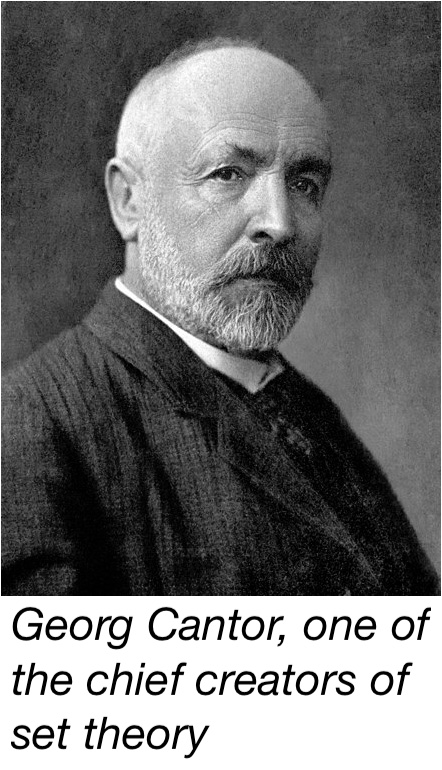
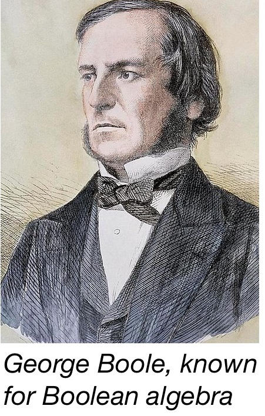
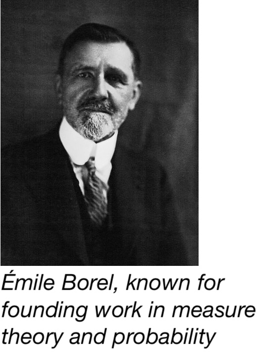
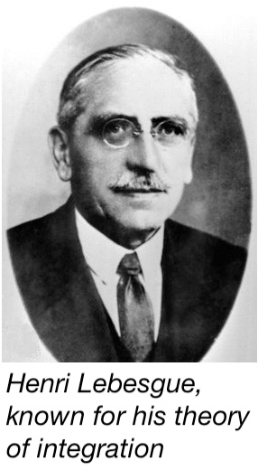

<!-- # set the overall width of the HTML page -->
<style type="text/css"> /* This sets the overall width of the HTML page */
  .main-container {
    /*max-width: 600px;   */
    margin-left: auto;
    margin-right: 10%;
  }
  body, td {
     font-size: 18px;
     /*font-family: Calibri;*/
     background: rgb(250,250,250);
  }
  code.r{                   /*for r code*/
    font-size: 16.5px;
  }
  pre {                 /*for output of knitr chunks*/
    font-size: 16.5px
    border: 0;
  }
  #TOC {
  color: purple;
  font-size: 15px; 
  }
  }
</style>

```{=latex}
\usepackage{amsmath}
```

<hr>

### Set algebra



<span style="color:purple;">Set algebra</span> or the algebra of sets (as a subject; not to be confused with the mathematical structure called algebra of sets) is a system that deals with the properties of sets, the laws of the set-theoretic operations of union, intersection and complementation, and the relations of set equality and set inclusion, and procedures for evaluating expressions using these laws.

$$\\[0.1in]$$


### Family of sets

A collection of sets is called a <span style="color:purple;">family of sets</span>. A collection of subsets of a set is called a family of subsets of that set. 

$$\\[0.1in]$$




### Ring of sets

***Definition using words:*** A <span style="color:purple;">ring of sets</span>, or a <span style="color:purple;">Boolean ring of sets</span>, is such a family of subsets of a set that the family is closed under the operations of finite union and set difference (also called relative complementation), which is to say, i) the union of a finite number of sets of the family belongs to the family and ii) the set difference of any two sets of the family belongs to the family. 

These conditions automatically imply that the empty set belongs to a ring of sets and a ring of sets is also closed under finite intersection. 

Ring of sets is the set-theoretic analogue of ring of numbers in abstract algebra (by taking symmetric set difference as addition and intersection as multiplication).

***Definition using mathematical symbols:*** A <span style="color:purple;">ring of sets</span> is a family, $\mathcal{A}$, of subsets of a set $X$ such that<br>

  (i) For every $A,B \in \mathcal{A}$, $A \cup B \in \mathcal{A}$, and <br>
  (ii) For every $A,B \in \mathcal{A}$, $A \setminus B \in \mathcal{A}$.

These automatically imply

  - $\emptyset \in \mathcal{A}$, and
  - For every $A,B \in \mathcal{A}$, $A \cap B \in \mathcal{A}$.

$$\\[0.1in]$$


### Algebra of sets (Field of sets)

***Definition using words:*** An <span style="color:purple;">algebra of sets</span>, or a <span style="color:purple;">Boolean algebra of sets</span>, is such a family of subsets of a set that the family contains the set itself and is closed under the operations of finite union and set difference (also called relative complementation), which is to say, i) the union of a finite number of sets of the family belongs to the family and ii) the set difference of any two sets of the family belongs to the family. 

These conditions automatically imply that the empty set belongs to an algebra of sets and an algebra of sets is also closed under finite intersection and absolute complementation. 

In other words, an algebra of sets of a set is a ring of sets that contains the set itself. 

Algebra of sets is the set-theoretic analogue of algebra of numbers in abstract algebra (by taking symmetric set difference as addition and intersection as multiplication).

A set and an algebra of sets of that set together is called <span style="color:purple;">field of sets</span>. However, some authors refer to the algebra of sets itself as a field of sets.

***Definition using mathematical symbols:*** An <span style="color:purple;">algebra of sets</span> is a family, $\mathcal{A}$, of subsets of a set $X$ such that<br>

  (i) $X \in \mathcal{A}$,
  (ii) For every $A,B \in \mathcal{A}$, $A \cup B \in \mathcal{A}$, and <br>
  (iii) For every $A,B \in \mathcal{A}$, $A \setminus B \in \mathcal{A}$.

These automatically imply

  - $\emptyset \in \mathcal{A}$,
  - For every $A,B \in \mathcal{A}$, $A \cap B \in \mathcal{A}$, and
  - For every $A \in \mathcal{A}$, $A^C \in \mathcal{A}$.

The pair $(X,\mathcal{A})$ is called a <span style="color:purple;">field of sets</span>. But some authors refer to $\mathcal{A}$ itself as a field of sets.

$$\\[0.1in]$$


### $\sigma$-ring of sets

***Definition using words:*** A <span style="color:purple;">$\sigma$-ring of sets</span>, or a <span style="color:purple;">Boolean $\sigma$-ring of sets</span> is such a family of subsets of a set that the family is closed under the operations of countable union and set difference (also called relative complementation), which is to say, i) the union of a countable number of sets of the family belongs to the family and ii) the set difference of any two sets of the family belongs to the family. 

These conditions automatically imply that the empty set belongs to a $\sigma$-ring of sets and a $\sigma$-ring of sets is also closed under countable intersection.

***Definition using mathematical symbols:*** A <span style="color:purple;">$\sigma$-ring of sets</span> is a family, $\mathcal{A}$, of subsets of a set $X$ such that<br>

  (i) For $A_n \in \mathcal{A}$ for all $n \in \mathbb{N}$, $\bigcup_{n=1}^{\infty} A_n \in \mathcal{A}$, and <br>
  (ii) For every $A,B \in \mathcal{A}$, $A \setminus B \in \mathcal{A}$.

These automatically imply

  - $\emptyset \in \mathcal{A}$, and
  - For $A_n \in \mathcal{A}$ for all $n \in \mathcal{N}$, $\bigcap_{n=1}^{\infty} A_n \in \mathcal{A}$.

$$\\[0.1in]$$


### $\sigma$-algebra ($\sigma$-field) of sets

***Definition using words:*** A <span style="color:purple;">$\sigma$-algebra of sets</span>, also called <span style="color:purple;">Boolean $\sigma$-algebra</span> or <span style="color:purple;">$\sigma$-field</span>, is such a family of subsets of a set that the family contains the set itself and is closed under the operations of countable union and set difference (also called relative complementation), which is to say, i) the union of a countable number of sets of the family belongs to the family and ii) the set difference of any two sets of the family belongs to the family. 

These conditions automatically imply that the empty set belongs to a $\sigma$-algebra of sets and a $\sigma$-algebra of sets is also closed under countable intersection and absolute complementation. 

In other words, a $\sigma$-algebra of sets of a set is an algebra of sets that contains the set itself.

A set and a $\sigma$-algebra of sets of that set together is called a <span style="color:purple;">measurable space</span>. 

***Definition using mathematical symbols:*** A <span style="color:purple;">$\sigma$-algebra of sets</span> is a family, $\mathcal{A}$, of subsets of a set $X$ such that<br>

  (i) $X \in \mathcal{A}$,
  (i) For $A_n \in \mathcal{A}$ for all $n \in \mathbb{N}$, $\bigcup_{n=1}^{\infty} A_n \in \mathcal{A}$, and <br>
  (ii) For every $A,B \in \mathcal{A}$, $A \setminus B \in \mathcal{A}$.

These automatically imply

  - $\emptyset \in \mathcal{A}$,
  - For every $A,B \in \mathcal{A}$, $A \cap B \in \mathcal{A}$, and
  - For every $A \in \mathcal{A}$, $A^C \in \mathcal{A}$.

The pair $(X,\mathcal{A})$ is called a <span style="color:purple;">measurable space</span>. 

$$\\[0.1in]$$


### $\sigma$-algebra generated by a family

***Definition using words:*** Given a family of subsets of a set, the smallest $\sigma$-algebra that covers that family, which is to say the smallest $\sigma$-algebra such that the family is a subset of that $\sigma$-algebra, is called the <span style="color:purple;">$\sigma$-algebra generated</span> by that family. This smallest $\sigma$-algebra is, in fact, the intersection of all $\sigma$-algebras that cover that family.

***Definition using mathematical symbols:*** Given a family of subsets, $S$, of $X$, the smallest $\sigma$-algebra, $\mathcal{S}$, such that $\mathcal{S} \supset S$ is called the <span style="color:purple;">$\sigma$-algebra generated</span> by $S$, and is denoted by $\sigma(S)$.

$$\\[0.1in]$$




### Borel algebra, Borel sets, Borel space

***Definition using words:*** Given a topological space, the $\sigma$-algebra generated by the family of all open sets (or equivalently, all closed sets) is called the <span style="color:purple;">Borel $\sigma$-algebra</span>, or <span style="color:purple;">Borel algebra</span>, or <span style="color:purple;">Borel field</span> for that topological space. The elements of a Borel algebra are called <span style="color:purple;">Borel sets</span>. The topological space and the corresponding Borel algebra taken together is called the <span style="color:purple;">Borel space</span>. However, in another usage of this term, the topological space together with any $\sigma$-algebra is called a Borel space. In the first usage, a Borel space is a unique measurble space for the given topological space, but in the second usage, a Borel space is just any measurable space for that topological space.

***Definition using mathematical symbols:*** Given a topological space $X$, the $\sigma$-algebra, $\mathcal{B}$, generated by the family of all open sets (or equivalently, all closed sets) is called the <span style="color:purple;">Borel $\sigma$-algebra</span>. $B$ is a <span style="color:purple;">Borel set</span> if $B \in \mathcal{B}$. The pair $(X,\mathcal{B})$ is called the <span style="color:purple;">Borel space</span>. By a second usage, $(X,\mathcal{A})$, for any $\sigma$-algebra $\mathcal{A}$, is called a Borel space.


***Why are the Borel sets important?*** The purpose of measure theory is to define the 'size' of a set in one sense or other, such as length, area, volume, count, probability etc. The generalized notion of any such size is called a measure. Given a set, the natural thought is to define a measure for all possible subsets of that set which go to form the power set of that set. However, through complicated constructions it is possible to obtain sets for which any consistent definition of a measure will lead to contradictions. So, 'set of all subsets' is too vast for defining a measure consistently. As another option, considering a topology on the given set, one may think of defining a measure on all the open subsets (or all the closed subsets) of that set. However, this choice is too restrictive because there are semi-open sets (such as the interval [0,1) in one-dimension) for which a measure should also be defined. So, one needs something between all subsets and all open subsets. Borel sets, which are sets generated from the open sets through the operations of countable union and set difference (or equivalently, countable union and countable intersection), lie in between and cover all the useful sets for which one may want to define a measure. This is why Borel sets are so important in measure theory.

$$\\[0.1in]$$


### Measurable function, Borel function

***Definition using words:*** A <span style="color:purple;">measurable function</span> is a function between the underlying sets of two measurable spaces such that the pre-image of any mesurable set is measurable, which is equivalent to saying, the pre-image of any element of the $\sigma$-algebra over the co-domain belongs to the $\sigma$-algebra over the domain.

A measurable function between two Borel spaces is called a <span style="color:purple;">Borel function</span>.

***Definition using mathematical symbols:*** Given two measurable spaces $(X,\mathcal{A})$ and $(Y,\mathcal{T})$, a function $f:X \to Y$ is a <span style="color:purple;">measurable function</span> if for every $E \in \mathcal{T}$,
$$f^{-1}(E) = \{x \in X : f(x) \in E \} \in \mathcal{A}.$$

Note that the definition of a measurable function depends on $\sigma$-algebra but does not depend on any already-defined measure.

$$\\[0.1in]$$


### Set function

A <span style="color:purple;">set function</span> is any function that has as its domain a family of sets, or more specifically a family of subsets of a given set, and that usually takes values in the extended real line $\overline{\mathbb{R}} = \mathbb{R} \cup \{ \pm\infty \}$.

$$\\[0.1in]$$


### Measure, measure space, Borel measure

***Intuition:*** A <span style="color:purple;">measure</span>, being quite a self-explanatory term, is any notion of 'size' of a set where size may mean length, area, volume, count, mass, density, or probability, etc. Thus, measure is a generalized concept of a 'size'. In any way that you can measure (used as an ordinary language verb) an object corresponds to a <span style="color:purple;">measure</span>.

***Definition using words:*** A <span style="color:purple;">measure</span> is a real-valued set function on a $\sigma$-algebra over a set that assigns to each element of the $\sigma$-algebra a real number or plus infinity, assigns 0 to the empty set, and is countably additive, which means, the measure of any set that can be decomposed into a countable number of pairwise disjoint subsets is equal to the sum of the measures of those disjoint subsets. 

The triple consisting of the set, the $\sigma$-algebra over the set and the measure is called the <span style="color:purple;">measure space</span>.

Considering the set as a topological space, any measure defined on the Borel sets is called a <span style="color:purple;">Borel measure</span>.

***Definition using mathematical symbols:*** Given a set $X$ and a $\sigma$-algebra $\mathcal{A}$ over $X$, a measure, $\mu$, is a set function $\mu: \mathcal{A} \to \overline{\mathbb{R}}$ such that

  i. For any $E \in \mathcal{A}$, $\mu(E) \geq 0$,
  ii. $\mu(\emptyset) = 0$, and
  iii. For any $\{A_k\}_{k=1}^{\infty} \in \mathcal{A}$ such that $A_i \cap A_j = \emptyset$ for all $1\leq i,j < \infty$, 
  $\mu\left(\bigcup_{k=1}^{\infty} A_k\right) = \sum_{k=1}^{\infty} \mu(A_k).$

The pair $(X,\mathcal{A})$ is the <span style="color:purple;">measurable space</span> (as also defined earlier) and the triple $(X,\mathcal{A},\mu)$ is called the <span style="color:purple;">measure space</span>. 

If $X$ is a topological space, any measure defined over the Borel algebra $\mathcal{B}$ of $X$ is called a <span style="color:purple;">Borel measure</span>.

***Note:*** Note that a measure is not a measurable function. Although both are functions and both depend on the same measurable space $(X, \mathcal{A})$, a measure is a set function defined on the sets of $\mathcal{A}$ whereas a measurable function is defined on elements $x$ of $X$. Further, measures are restricted to non-negative functions only.

***Note:*** Countable additivity lies in between finite additivity and uncountable additivity. In the definition of measure countable additivity is used because using finite additivity won't let one investigate any kind of limit of the measure. On the other hand, using uncountable additivity will kill the purpose of defining a size through measure, because in that case, for example, if a singleton subset of $\mathbb{R}$ has measure 0, that would mean all subsets of $\mathbb{R}$ has measure 0.

$$\\[0.1in]$$


### Outer measure, outer measurable

***Intuition*** An outer measure is an attempt to approximate the size of a set from outside. 

***Definition using words:*** [Caratheodory] An <span style="color:purple;">outer measure</span> is a set function on the power set of a set that assigns to each element of the power set a real number or plus infinity, assigns 0 to the empty set, is monotone, which means the outer measure of any set is bounded above by the outer measure of any superset of the set, and is countably subadditive, which means the outer measure of the union of a sequence of pairwise disjoint sets is bounded above by the sum of the outer measures of the individual sets.

An alternative but equivalent definition is that an <span style="color:purple;">outer measure</span> is a set function on the power set of a set that assigns to each element of the power set a real number or plus infinity, assigns 0 to the empty set, is countably subadditive in the sense that if an arbitrary sequence of sets cover a certain set, then the outer measure of that set will be bounded above by the sum of the outer measures of the sets of that sequence.

[Lebesgue] This definition was considered by Lebesgue for defining (Lebesgue) measure in Eucledian space. For any given subset of the real line, the <span style="color:purple;">Lebesgue outer measure</span> of that subset is defined as the infimum of the sum of the individual lengths of countably many open intervals which form a sequence that covers that subset. The infimum extends over all such sequences. This definition is equivalent to the above ones.

A given subset of the set is <span style="color:purple;">outer-measurable</span> if the outer measure of every subset of the set can be decomposed into two parts---the outer measure of the intersection of the subset with the given subset and the outer measure of the set difference of the subset with the given subset.

***Definition using mathematical symbols:*** [Caratheodory] Given a set $X$, an <span style="color:purple;">outer measure</span> is a function $\mu^{\ast}:2^X \to \overline{\mathbb{R}}$ such that

  i. $\mu^{\ast} (\emptyset) = 0$,
  ii. for any $A \subseteq B$, $\mu^{\ast}(A) \leq \mu^{\ast}(B)$, and
  iii. for any $\{A_n\}_{n=1}^{\infty}$ with $A_i\cap A_j=\emptyset$ for all $1\leq i,j < \infty$, 
  $\mu^{\ast}\left(\bigcup_{n=1}^{\infty}\right) \leq \sum_{n=1}^{\infty} \mu^{\ast}(A_n)$.

An alternative definiton is, given a set $X$, an <span style="color:purple;">outer measure</span> is a function $\mu^{\ast}:2^X \to \overline{\mathbb{R}}$ such that

  i. $\mu^{\ast} (\emptyset) = 0$, and
  ii. for any $\{A_n\}_{n=1}^{\infty}$ and $A$, if $A \subseteq \bigcup_{n=1}^{\infty}A_n$, then $\mu^{\ast}(A) \leq \sum_{n=1}^{\infty} \mu^{\ast}(A_n).$

[Lebesgue] Suppose length of an interval $I$ is denoted by $l(I)$. Then, for $A \subseteq \mathbb{R}$, the <span style="color:purple;">Lebesgue outer measure</span>, $\lambda^{\ast}$, of $A$ is defined as
$$\lambda^{\ast}(A) = \inf \left\{ \sum_{k=1}^{\infty} l(I_k) : \{I_k\}_{k=1}^{\infty} \text{ is a sequence of open sets, } \bigcup_{k=1}^{\infty} I_k \supseteq A \right\}.$$

[Caratheodory] Any $S \in 2^X$ is <span style="color:purple;">$\mu^{\ast}$-measurable</span> if and only if for every $E \in 2^X$, 

$$\mu^{\ast}(E) = \mu^{\ast}(E \cap S) + \mu^{\ast}(E \setminus S).$$

***Note:*** A measure is an outer measure, but an outer measure is not a measure, because unlike a measure, an outer measure has to be defined on all subsets of a set, i.e., on the power set. Whereas a measure is countably additive, an outer measure is countably subadditive. In fact, the purpose of using an outer measure is to find out a family of subsets within which countable additivity holds, call these subsets measurable subsets and define a measure on them.

$$\\[0.1in]$$


### Inner measure

***Concept:*** An inner measure is an attempt to approximate the size of a set from inside.

***Definition using words:*** [Caratheodory] An <span style="color:purple;">inner measure</span> is a set function on the power set of a set that is induced by an outer measure such that the inner measure of a given subset is equal to the supremum of the outer measures of all outer measurable subsets of the given subset.

An alternative definition [Lebesgue] is, an <span style="color:purple;">inner measure</span> is a set function on the power set of a set that is induced by an outer measure such that the inner measure of any subset is equal to the outer measure of its complement being subtracted from the outer measure of the set itself, the latter being finite.

A second alternative definition that generalizes the above two is, an <span style="color:purple;">inner measure</span> is a set function on the power set of a set that assigns to each element of the power set a real number or plus infinity, assigns 0 to the empty set, is countably superadditive, which means the inner measure of the union of a sequence of pairwise disjoint sets is bounded below by the sum of the inner measures of the individual sets, and for a decreasing sequence of subsets with the first one having finite inner measure, the inner measure of the intersection of all the elements of the sequence is equal to the sequencial limit of the inner measure of an element.

***Definition using mathematical symbols:*** [Caratheodory] An <span style="color:purple;">inner measure</span> $\mu_{\ast}$ is a set function that is induced by an outer measure $\mu^{\ast}:2^X \to \overline{\mathbb{R}}$ such that for all $A \in 2^X$,
$$\mu_{\ast}(A) = \sup\{ \mu^{\ast}(M): M \subset A, \; M \text{ is } \mu^{\ast} \text{-measurable} \}.$$

An alternative definition [Lebesgue] is, an <span style="color:purple;">inner measure</span> $\mu_{\ast}$ is a set function that is induced by an outer measure $\mu^{\ast}:2^X \to \overline{\mathbb{R}}$ with $\mu^{\ast}(X) < \infty$, such that for all $A \in 2^X$,
$$\mu_{\ast}(A) = \mu^{\ast}(X) - \mu^{\ast}(A^C).$$

A second alternative definition that generalizes the above two is, given a set $X$, an <span style="color:purple;">inner measure</span> is a function $\mu_{\ast}:2^X \to \overline{\mathbb{R}}$ such that

  i. $\mu^{\ast} (\emptyset) = 0$,

  ii. for any $\{A_n\}_{n=1}^{\infty}$ with $A_i\cap A_j=\emptyset$ for all $1\leq i,j < \infty$, 
  $\mu_{\ast}\left(\bigcup_{n=1}^{\infty}\right) \geq \sum_{n=1}^{\infty} \mu_{\ast}(A_n), \quad \text{and}$

  iii. for any $\{B_n\}_{n=1}^{\infty}$ with $B_j \supseteq B_{j+1}$ for each $j$ and $\mu_{\ast}(B_1) < \infty$,

  $\mu_{\ast} \left(\bigcap_{n=1}^{\infty}B_n\right) = \lim_{n\to\infty} \mu_{\ast}(B_n).$

$$\\[0.1in]$$


### Counting measure

***Definition using words:*** A <span style="color:purple;">counting measure</span> is a measure that considers number of elements of a set in its domain as the 'size' of the set.

***Definition using mathematical symbols:*** A <span style="color:purple;">counting measure</span> $\mu$ on the measurable space $(X,\mathcal{A})$ is a measure such that for all $A \in \mathcal{A}$,

$$\mu (A)={\begin{cases} |A|     & \text{if }A\text{ is finite} \\
                       +\infty &\text{if }A\text{ is finite}
           \end{cases}},$$

where $|A|$ is the cardinality of $A$.

$$\\[0.1in]$$




### Lebesgue measure

***Intuition:*** A <span style="color:purple;">Lebesgue measure</span> is a measure defined on the subsets of $n$-dimensional Euclidean space. It considers the length of an interval (subset of $1$-dimensional Euclidean space or the real line) as the 'size' of that interval and then generalizes this idea of size to define measure for larger sets. Length of a bounded interval is defined as the difference between its endpoints and length of an unbounded interval is defined as infinity.

***Definition using words:*** Originally, Lebesgue defined a subset of Eucledian space to be measurable if the outer measure of that subset was equal to its inner measure (his definitions of outer and inner measures are discussed earlier). But, at that time he did not know about the existence of non-measurable sets.

Since Caratheodory's work, Lebesgue measurability is obtained by restricting Lebesgue outer measures to Caratheodory measurable sets (also discussed earlier) and these sets are considered <span style="color:purple;">Lebesgue-measurable sets</span>. The sets that do not satify the Caratheodory condition are considered not Lebesgue-measurable. The Lebesgue-measurable sets form a $\sigma$-algebra. The <span style="color:purple;">Lebesgue measure</span> of any Lebesgue-measurable set is defined to be the Lebesgue outer measure that set. The Lebesgue measure defined thus defined is countably additive.

$$\\[0.1in]$$


### Probability measure

***Definition using words:*** The <span style="color:purple;">probability measure</span>, or <span style="color:purple;">probability</span>, of a measurable subset of a set is a set function on the sigma-field over the set that takes values in between 0 and 1 including the endpoints, assigns 0 to the empty set and 1 to set itself, and is countably additive, which means, the probability of a set that can be decomposed into a countable number of pairwise disjoint subsets is equal to the sum of the probabilities of those disjoint subsets.

In connection with probability measure, $\Omega$ is generally called the <span style="color:purple;">sample space</span> and the elements of the $\sigma$-field are called <span style="color:purple;">events</span>. The triple consisting of the sample space, the $\sigma$-field and the probability measure is called the <span style="color:purple;">probability space</span>.

***Definition using mathematical symbols:*** Given a measurable space $(\Omega,\mathcal{F})$, a <span style="color:purple;">probability measure</span>, or <span style="color:purple;">probability</span>, $P$, is a set function on $\mathcal{F}$ such that:

  i. For all $A \in \mathcal{F}$, $0\leq P(A) \leq 1$,

  ii. $P(\emptyset)=0$, $P(\Omega)=1$, and

  iii. For any $\{A_k\}_{k=1}^{\infty} \in \mathcal{F}$ such that $A_i \cap A_j = \emptyset$ for all $1\leq i,j < \infty$, 
  $P\left(\bigcup_{k=1}^{\infty} A_k\right) = \sum_{k=1}^{\infty} P(A_k).$

The triple $(\Omega,\mathcal{F},P)$ is called the <span style="color:purple;">probability space</span>.

***Note:*** Note that, when the sample space is uncountable, probability is defined only on the sets included in the $\sigma$-algebra. But, if the sample space is countable or discrete, probability can be defined for all sets of the power set so that explicit mention of $\sigma$-field can be avoided.

$$\\[0.1in]$$


### Random variable

***Definition using words:*** Given a probability space, a <span style="color:purple;">random variable</span> is a measuarble function from the sample space to the real line.

***Definition using mathematical symbols:*** Given a probability space $(\Omega,\mathcal{F},P)$, a <span style="color:purple;">random variable</span> is a measuarble function $X:\Omega \to \mathbb{R}$.

***Note:*** Note that, in general, the definition of a measurable function only depends on the measurable space and does not need any measure to be already defined. But a random variable, although a measurable function, is defined when a probability measure $P$ is already attached to the measurable space $(\Omega,\mathbb{F})$ and one has a probability space $(\Omega,\mathcal{F},P)$. 

***Note:*** The word 'random' in random variable does not imply that the function randomly assigns values to the events. Given the outcome(s), the assignment of values to any event is, in fact, systematic and definite. The randomness referred to by the word 'random' is the randomness associated with the outcome of the experiment. The outcomes are random because one does not have perfect knowledge or control of the physics guiding the experiment.

$$\\[0.1in]$$


### Probability space induced by a random variable

***Definition using words:*** A random variable is a measurable function between the underlying sets of a probability space and the Borel space of the real line such that the pre-image of any Borel-measurable set belonging to the Borel $\sigma$-algebra belongs to the $\sigma$-algebra of the probability space. The family of all such pre-images form a $\sigma$-algebra, which is called the <span style="color:purple;">$\sigma$-algebra induced/generated by the random variable</span>.

Further, a probability measure can be defined over all such pre-images using the original probability measure of the probability space. This newly defined probability measure is called the <span style="color:purple;">probability measure induced/generated by the random variable</span>.

The triple consisting of the real line, the Borel algebra of the real line and the induced probability measure is called the <span style="color:purple;">probability space induced/generated by the random variable</span>.

***Definition using mathematical symbols:*** Given a probability space $(\Omega,\mathbb{F},P)$ and the Borel space of real line $(\mathbb{R},\mathcal{B})$, a random variable is a mesurable function $X:\Omega \to \mathbb{R}$ such that for any $B \in \mathcal{B}$, its pre-image $X^{-1}(B) = \{w \in \Omega: X(w) \in B \} \in \mathbb{F}$. The family $\{X^{-1}(B),B \in \mathcal{B} \}$ forms a $\sigma$-algebra and is called the <span style="color:purple;">$\sigma$-algebra induced/generated by $X$</span>.

A probability measure $P_X$ can be defined on $\mathcal{B}$ such that $P_X(B)=P(X^{-1}(B))$ for all $B \in \mathcal{B}$. $P_X$ is called the <span style="color:purple;">probability measure induced/generated by $X$</span>.

The triple $(\mathbb{R},\mathcal{B},P_X)$ is called the <span style="color:purple;">probability space induced/generated by $X$</span>.

$$\\[0.1in]$$


### Random element

***Intuition:*** A random variable has the real line as its co-domain. A random element is a generalization of the concept of random variable where the co-domain is a set of arbitrary type of elements such as numbers, vectors, matrices, sequences, trees, sets, shapes, manifolds, functions, measures and so on.

***Definition using words:*** Given a probability space, a <span style="color:purple;">random element</span> is a measuarble function from the sample space to a suitable space of elements. 

***Definition using mathematical symbols:*** Given a probability space $(\Omega,\mathcal{F},P)$ and a measurable space $(E,\mathcal{E})$, a <span style="color:purple;">random element</span> or a <span style="color:purple;">$(E,\mathcal{E})$-valued random variable</span> is a measuarble function $X:\Omega \to E$.

***Note:*** Using the term random variable in this general sense, the random variable defined earlier will be called a real-valed random variable.

- If $E=\mathbb{R}$, $X$ is a random variable.

- If $E=\mathbb{R^n}$, $X$ is a random vector.

- If $E=\mathbb{R}$, $X$ is a random variable.


$$\\[0.1in]$$


### Random function

***Definition using words:*** Given a probability space, a <span style="color:purple;">random function</span> is a function-valued random element such that it is a measuarble function from the sample space to a space of real-valued functions, i.e., functions between an index set and the real line.

- If the index set is singleton, the random function is a <span style="color:purple;">random variable</span> (used in the particular sense). <br>

- If the index set is finite, the random function is a <span style="color:purple;">random vector</span>. <br>

- If the index set is the set of natural numbers,i.e., countable, the random function is a <span style="color:purple;">random sequence</span>. <br>

- If the index set is a matrix, the random function is a <span style="color:purple;">random matrix</span>. <br>

- If the index set is a subset of the real line, the random function is a <span style="color:purple;">random process</span>, or <span style="color:purple;">stochastic process</span>, or simply <span style="color:purple;">process</span>. <br>

- If the index set is a subset of $n$-dimensional real space, i.e., a manifold, the random function is a <span style="color:purple;">random field</span>. <br>

- If the index set is a $\sigma$-algebra over subsets of some space, the random function is a <span style="color:purple;">random measure</span> (which is discussed below specifically). <br>

An equivalent definition is, given a probability space, a <span style="color:purple;">random function</span> is a mesurable function from the product space of the sample space and an index set to the real line, which means, it is a function two variables. 

- If the first variable is fixed to a particular value, the random function becomes a particular function from the index set to the real line. Such functions are called <span style="color:purple;">sample functions</span> or <span style="color:purple;">realizations of the random variable</span>, and for one-dimensional index set, are also called <span style="color:purple;">sample paths</span> or <span style="color:purple;">trajectories</span> of the random process. With different choices of the second variable, the random function becomes different types of random elements as described above. 

***Definition using mathematical symbols:*** Given a probability space $(\Omega,\mathcal{F},P)$, a <span style="color:purple;">random function</span>, $X$, is a function-valued random element such that $X:\Omega \to \{f: T \to \mathbb{R} \}$. Denoting by $\mathbb{R}^T$ the set of all functions of the form $f(t)$ from a set $T$ to $\mathbb{R}$, we have $X:\Omega \to \mathbb{R}^T$.

- If $T$ is singleton, $X$ is a <span style="color:purple;">random variable</span>.

- If $T$ is finite, $X$ is a <span style="color:purple;">random vector</span>.

- If $T$ = \mathbb{N}, $X$ is a random <span style="color:purple;">sequence</span>.

- If $T$ is a matrix, $X$ is a <span style="color:purple;">random matrix</span>.

- If $T \subset \mathbb{R}$, $X$ is a <span style="color:purple;">random process</span> or <span style="color:purple;">stochastic process</span>, or simply <span style="color:purple;">process</span>.

- If $T \subset \mathbb{R}^n, n > 1$ (i.e., a manifold), $X$ is a <span style="color:purple;">random field</span>.

- If $T$ is a $\sigma$-algebra of subsets of some space, then $X$ is a <span style="color:purple;">random measure</span> (which is discussed below specifically).

An equivalent definition is that, given a probability space $(\Omega,\mathcal{F},P)$ and an index set $T$, a <span style="color:purple;">random function</span>, $X$, is a function of two variables, taking values $\{X(\omega,t)=X_t(\omega):\omega \in \Omega,t \in T \}$, such that $X:\Omega \times T \to \mathbb{R}$.

If $\omega$ is fixed, $X$ becomes a function $X(w):T \to \mathbb{R}$, and is called a <span style="color:purple;">sample function</span> or a <span style="color:purple;">realization of the random variable</span>, and for one-dimensional $T$, is also called a <span style="color:purple;">sample path</span> or a <span style="color:purple;">trajectory</span> of the random process $X$. If $t$ is fixed, $X$ becomes a random variable $X_t:\Omega \to \mathbb{R}$.

***Note:*** A random function is called so not because it is a function, but because it maps to a space of ‘functions’.

$$\\[0.1in]$$


### Random measure

There are two equivalent definitions.

***Definition 1 using words:*** Given a probability space, a <span style="color:purple;">random measure</span> is a measure-valued random element from the sample space to a space of measures where all the measures are defined on the same $\sigma$-field of some measurable space.

***Definition 1 using mathematical symbols:*** Given a probability space $(\Omega,\mathcal{F},P)$ and a measurable space $(E,\mathcal{E})$, a <span style="color:purple;">random measure</span>, $X$, is a measure-valued random element from $(\Omega,\mathcal{F},P)$ to $(\tilde{M},\tilde{\mathcal{M}})$, where $\tilde{M}$ is the space of all measures on $(E,\mathcal{E})$ and $\tilde{\mathcal{M}}$ is the $\sigma$-algebra over $\tilde{M}$.

***Definition 2 using words:*** Given a probability space and another measurable space, a <span style="color:purple;">random measure</span> is a mesurable function from the product space of the sample space and the $\sigma$-field of that measurable space to the real line, which means, it is a function two variables, such that if the first variable is fixed to a particular value, the function becomes a particular measure on that $\sigma$-field and if the second variable is fixed to a particular set, the function becomes a measurable function on the probability space.

***Definition 2 using mathematical symbols:*** Given a probability space $(\Omega,\mathcal{F},P)$ and a measurable space $(E,\mathcal{E})$, a <span style="color:purple;">random measure</span>, $X$, is a function of two variables, taking values $\{X(\omega,B):\omega \in \Omega, B \in \mathcal{E} \}$, with $X:\Omega \times \mathcal{E} \to \mathbb{\overline{R}}$ (such $X$ is called a transition kernel from $\Omega \to E$), such that for a fixed $\omega$, $X$ is a measure on $\mathcal{E}$ and for a fixed $B$, $X$ is an $\mathcal{F}$-measurable random variable. 

***Note:*** $E$ is usually taken as a separable complete metric space and $\mathcal{E}$, as the Borel $\sigma$-algebra over $E$. Further, $\tilde{M}$ is usually taken as the space of all locally finite measures $\mu$ and $\tilde{\mathcal{M}}$, the $\sigma$-algebra over such $\tilde{M}$, generated by the projection maps $\pi_B:\mu \mapsto \mu(B)$ for all $B\in\mathcal{E}$. As to why such choices are made, I quote from the footnote at P-1 of Kallenberg, - Random Measures, Theory and Applications:

> The theory has often been developed under various metric or topological assumptions, although such a structure plays no role, except in the context of weak convergence."


