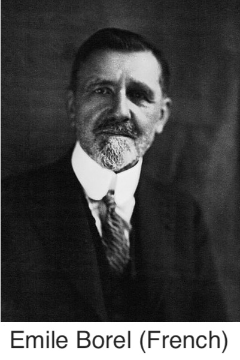
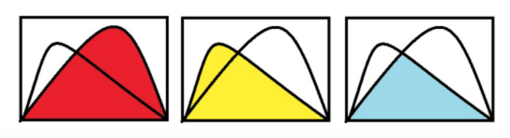
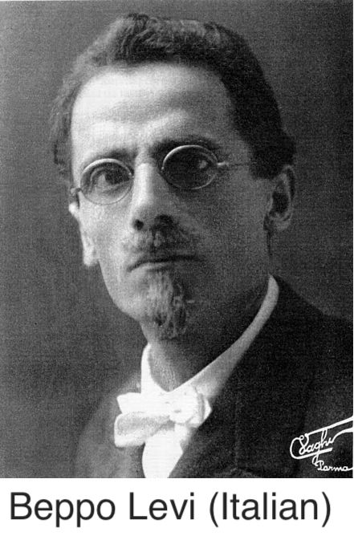
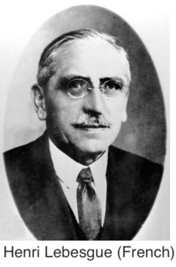
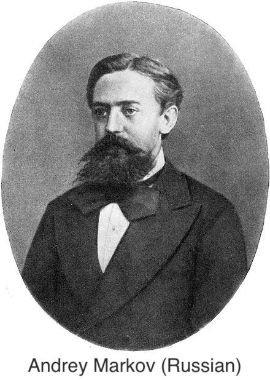
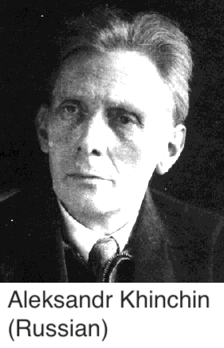
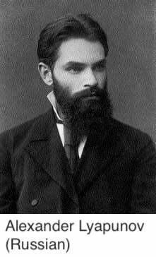
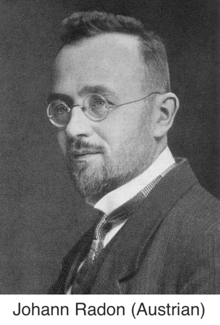
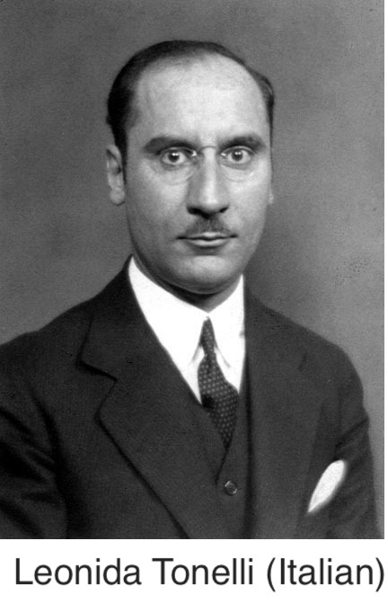
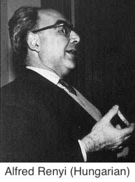

<!-- # set the overall width of the HTML page -->
<style type="text/css"> /* This sets the overall width of the HTML page */
  .main-container {
    /*max-width: 600px;   */
    margin-left: auto;
    margin-right: 10%;
  }
  body, td {
     font-size: 18px;
     /*font-family: Calibri;*/
     background: rgb(250,250,250);
  }
  code.r{                   /*for r code*/
    font-size: 16.5px;
  }
  pre {                 /*for output of knitr chunks*/
    font-size: 16.5px
    border: 0;
  }
  #TOC {
  color: purple;
  font-size: 15px; 
  }
  }
</style>

```{=latex}
\usepackage{amsmath}
```

<font size=2>Source of the portrait images: [Wikipedia.org](Wikipedia.org) or [https://mathshistory.st-andrews.ac.uk/Biographies/](https://mathshistory.st-andrews.ac.uk/Biographies/)</font>

<hr>



### Borel-Cantelli Lemma

***Definition in words:*** For a sequence of events, if the sum of the individual probabilities of the events is finite, then the probability of the limit supremum of the sequence of events is zero, or in other words, the probability of a set of outcomes occuring infinitely often in the sequence is zero.

***Definition using mathematical symbols:*** For a sequence of events $(E_n)_1^{\infty}$, if $\sum_{n=1}^{\infty} P(E_n) < \infty$, then $P(\limsup _{n\to \infty }E_n)=0$.


$$\\[0.1in]$$


### Second Borel-Cantelli Lemma

***Definition in words:*** For a sequence of independent events, if the sum of the individual probabilities of the events diverges, then the probability of the limit supremum of the sequence of events is one, or in other words, with probability one a set of outcomes occur infinitely often in the sequence.

***Definition using mathematical symbols:*** For a sequence of independent events $(E_n)_1^{\infty}$, if $\sum_{n=1}^{\infty} P(E_n) = \infty$, then $P(\limsup _{n\to \infty }E_n)=1$.

$$\\[0.1in]$$


### Slutsky's theorem


***Intuition:*** <span style="color:purple;">Slutsky's theorem</span> extends the results of some algebraic operations on real sequences to sequences of random variables.

***Definition in words:*** If a sequence of random variables converges in distribution to a certain random variable and another sequence of random variables converges in probability to a certain constant, then<br>
(i) the sum of the two sequences of random variables will converge in distribution to the sum of that certain random variable and that certain constant,<br>
(ii) the product of the two sequences of random variables will converge in distribution to the product of that certain random variable and that certain constant,<br>
(iii) the ratio of the first sequence of random variables to the second one will converge in distribution to the ratio of that certain random variable to that certain constant, provided the constant is non-zero.

***Definition using mathematical symbols:*** If $\{X_n\}$ and $\{Y_n\}$ are two sequences of random variables such that $X_n \overset{d}{\to} X$, a random variable and $Y_n \overset{P}{\to} c$, a constant, then <br>
(i) $X_n + Y_n \overset{d}{\to} X + c$, <br>
(ii) $X_n Y_n \overset{d}{\to} cX$, <br>
(iii) $X_n / Y_n \overset{d}{\to} X / c$, $c \neq 0$.


$$\\[0.1in]$$


### Fatou's Lemma


***Intuition*** Fatou's lemma, monotone convergence theorem and dominated convergence theorem--three main results in Lebesgue integration theory--tell when the two operations, limit and integration, may or may not commute.

***Definition in words:*** For a sequence of non-negative measurable functions defined on a measure space with a Lebesgue measure, <span style="color:purple;">Fatou's Lemma</span> states that (with respect to the measure) the integral of the limit infimum of the functions is less than or equal to the limit infimum of the integral of the functions.

***Definition using mathematical symbols:*** For a sequence of measurable functions, $f_n$, defined on a measure space $(\Omega,\mathcal{F},\mu)$, $\mu$ being a Lebesgue measure, such that $f_n:\Omega \to [0,\infty]$, <span style="color:purple;">Fatou's Lemma</span> states that
$$\int \liminf_{n\to\infty} \; f_n d\mu \leq \liminf_{n\to\infty} \int f_n d\mu. $$

***Note:*** Fatou's lemma can be quickly remembered through the following image where the first two plots show individual integrals of two functions (shaded) and the last plot shows the integral of the limit infimum of the two functions (shaded). Even the smaller of the first two integrals is larger than the last one.

{width=60%}

***Note:*** The functions are taken as non-negative so that the integrals exist, else there might be cases where integral becomes like $\infty-\infty$ which is not well-defined. 

$$\\[0.1in]$$


### Monotone convergence theorem



***Definition in words:*** For a sequence of non-negative and non-decreasing measurable functions defined on a measure space with a Lebesgue measure, the <span style="color:purple;">monotone convergence theorem</span> states that (with respect to the measure) the limit of the individual integrals of the functions is equal to the integral of the (pointwise) limit of the functions where the latter limit exists because of non-negativity and monotonicity and is equal to some real number or infinity.

***Definition using mathematical symbols:*** For a sequence of measurable functions, $f_n$, defined on a measure space $(\Omega,\mathcal{F},\mu)$, $\mu$ being a Lebesgue measure, such that $f_n:\Omega \to [0,\infty]$ and $f_k(x)\leq f_{k+1}(x) \; \forall k \text{ and } \forall x$, the <span style="color:purple;">monotone convergence theorem</span> states that
$$\lim_{n\to\infty} \int f_n \; d\mu = \int \lim_{n\to\infty} \; f_n \; d\mu.$$
This version is due to Beppo levi.

$$\\[0.1in]$$


### Dominated convergence theorem



***Definition in words:*** If a sequence of measurable functions defined on a measure space with a Lebesgue measure is such that the sequence converges pointwise to a certain function and is dominated by some integrable function in the sense that the absolute values of all the functions are bounded above by the values of the integrable function, then the <span style="color:purple;">dominated convergence theorem</span> states, (with respect to the measure) that certain function is integrable and the limit of the individual integrals of the functions of the sequence is equal to the integral of that certain function.

***Definition using mathematical symbols:*** For a sequence of measurable functions, $f_n$, defined on a measure space $(\Omega,\mathcal{F},\mu)$, $\mu$ being a Lebesgue measure, such that $f_n:\Omega \to [-\infty,\infty]$, $f(x)=\lim_{n\to\infty} f_n(x)$ exists and $\forall x, |f_n(x)|\leq g(x)$ where $g:\Omega \to [0,\infty]$ is an integrable function, then the <span style="color:purple;">dominated convergence theorem</span> states that $f$ is integrable and
$$\lim_{n\to\infty} \int f_n \; d\mu = \int f \; d\mu.$$

$$\\[0.1in]$$


### Convergence of random variables

***Introduction:*** A random variable is basically a function. So, a sequence of random variables is basically a sequence of functions. But as random variables are defined in a probability space, any notion of convergence for a sequence of random variables has to be defined in terms of probability.

For a sequence of random variables, we can generally consider four types of convergence---convergence in distribution/law, convergence in probability, convergence in finite-order mean and almost sure convergence.

***Definition in words:***

**Convergence in distribution:** A sequence of real-valued random variables is said to converge to a certain random variable in distrbution/law if, as the sequenial index increases, the cumulative distribution function of sequential random variable tends to the cumulative distribution function of that certain random variable at all continuity points of the latter.

**Convergence in probability:** A sequence of real-valued random variables is said to converge to a certain random variable in probability if for any given small number, as the sequenial index increases, the probability of the difference between the sequential random variable and that certain random variable being greater than that small number tends to zero.

**Convergence in $r$th mean:** A sequence of real-valued random variables is said to converge to a certain random variable in $r$th mean if the $r$th order absolute moments of all random variables exist and if, as the sequenial index increases, the expected value of the $r$th power of the difference between the sequential random variable and that certain random variable tends to zero.

**Convergence almost surely:** A sequence of real-valued random variables is said to converge to a certain random variable almost surely or almost everywhere if the probability of the limit of the sequence being equal to that certain random variable is one, or in other words, for any given small number, as the sequenial index increases, the probability of the difference between the sequential random variable and that certain random variable being greater than that small number for all indices greater than the present index tends to zero.

***Definition using mathematical symbols:*** 

**Convergence in distribution:** A sequence of real-valued random variables, $(X_n)_1^{\infty}$, with distribution functions $(F_n)$ is said to converge to a  random variable $X$ with distribution function $F$ in distrbution/law, denoted by $X_n\overset{d}{\to}X$ or $X_n\overset{L}{\to}X$, if
$$\lim_{n\to\infty} F_n(x) = F(x), \; \forall x \text{ where } F \text{ is continuous.}$$

**Convergence in probability:** A sequence of real-valued random variables, $(X_n)_1^{\infty}$, is said to converge to a random variable $X$ in probability, denoted by $X_n\overset{p}{\to}X$, if 
$$\forall \; \epsilon>0,\; \lim_{n\to\infty} P(|X_n-X|>\epsilon) = 0.$$ 

**Convergence in $r$th mean:** A sequence of real-valued random variables, $(X_n)_1^{\infty}$, is said to converge to a random variable $X$ in $r$th mean, denoted by $X_n\overset{r}{\to}X$ or $X_n\overset{L^r}{\to}X$, if
$$\forall \; \epsilon>0,\; \lim_{n\to\infty} E(|X_n-X|^r) = 0.$$

**Convergence almost surely:** A sequence of real-valued random variables, $(X_n)_1^{\infty}$, is said to converge to a random variable $X$ almost surely or almost everywhere, denoted by $X_n\overset{a.s.}{\to}X$, if 
$$P\left(\lim_{n\to\infty} X_n = X\right)=1,$$
or equivalently
$$\forall \; \epsilon>0,\; \lim_{n\to\infty} P(|X_k-X|\leq\epsilon,\forall\; k\geq n) = 1.$$

***Note:*** Convergence in probabiliy tells that $X_n$ becomes increasingly closer to $X$ as $n\to\infty$ whereas almost sure convergence tells $X_n$ does not equal $X$ for only a finite number of terms of the sequence after which all $X_n$ become equal to $X$. But we don't know that finite number and there is no way to know in practice. So, although almost sure convergence is stronger than convergence in probability, the difference between them is more philosophical than practical. Almost sure convergence is equivalent to point-wise convergence of sequence of ordinary functions.

$$\\[0.1in]$$


### Markov's inequality



***Definition in words:*** For a Lebesgue-integrable random variable with finite expected value, <span style="color:purple;">Markov's inequality</span> (or <span style="color:purple;">first Chebyshev's inequality</span>) states that the upper bound of the probability of a non-negative random variable being greater than or equal to a constant is the expected value divided by that constant.

***Definition using mathematical symbols:*** For a Lebesgue-integrable random variable $X$ with finite expected value $\mu$, <span style="color:purple;">Markov's inequality</span> states that 
$$P(X\geq a) \leq {E(X) \over a}.$$

$$\\[0.1in]$$


### Chebyshev's inequality


***Definition in words:*** For a Lebesgue-integrable random variable with finite expected value and finite non-zero variance, <span style="color:purple;">Chebyshev's inequality</span> (or <span style="color:purple;">second Chebyshev's inequality</span>) or <span style="color:purple;">Bienaymé's inequality</span> states that no more than $1/k^2$ of its distribution's values may lie k or more standard deviation away from the expected value.

***Definition using mathematical symbols:*** For a Lebesgue-integrable random variable $X$ with finite expected value $\mu$ and finite non-zero variance $\sigma^2$, 
$$P(|X-\mu|\geq k\sigma) \leq {1 \over k^2}.$$

$$\\[0.1in]$$


### Khinchin WLLN



***Definition in words:*** For a sequence of independent and identically distributed Lebesgue measurable random variables, the <span style="color:purple;">(Khinchin's) weak law of large numbers</span> states that the mean of the random variables will converge in probability to the expected value.

***Definition using mathematical symbols:*** For a sequence of independent and identically distributed Lebesgue measurable random variables $X_n$ with common mean $\mu$, the <span style="color:purple;">(Khinchin's) weak law of large numbers</span> states that 
$$\overline{X}_n \overset{P}{\to} \mu \text{ as } n\to\infty.$$

***Note:*** WLLN can be proved using the Chebyshev's inequality.

$$\\[0.1in]$$


### Borel's SLLN

***Note:*** Historically, Borel proposed the first SLLN for Bernoulli scheme with success probability 1/2 in 1909. (The name SLLN was introduced by Khinchin later in 1927.)

***Definition in words:*** <span style="color:purple;">Borel's SLLN</span> states that the average number of success in a number of Bernoulli trials converges almost surely to the probability of success at each trial.

***Definition using mathematical symbols:*** If $S_n$ is the total number of successes in $n$ Bernoilli trials with success probability $p$, then <span style="color:purple;">Borel's SLLN</span> states that
$${S_n \over n} \overset{a.s.}{\to} p.$$

For a sequence of independent and identically distributed Lebesgue measurable random variables $X_n$ with common mean $\mu$, the <span style="color:purple;">(Kolmogorov's) strong law of large numbers</span> states that 
$$\overline{X}_n \overset{a.s.}{\to} \mu \text{ as } n\to\infty.$$

$$\\[0.1in]$$


### Kolmogorov's SLLN


***Definition in words:*** For a sequence of independent and identically distributed Lebesgue measurable random variables, the <span style="color:purple;">(Kolmogorov's) strong law of large numbers</span> states that the mean of the random variables will converge almost surely to the expected value.

***Definition using mathematical symbols:*** For a sequence of independent and identically distributed Lebesgue measurable random variables $X_n$ with common mean $\mu$, the <span style="color:purple;">(Kolmogorov's) strong law of large numbers</span> states that 
$$\overline{X}_n \overset{a.s.}{\to} \mu \text{ as } n\to\infty.$$

$$\\[0.1in]$$


### Glivenko-Cantelli Theorem


***Note:*** For empirical distribution function, the Glivenko-Cantelli theorem shows that the SLLN holds not merely in the usual pointwise sense, but in the uniform sense.

***Definition in words:*** For a sequence of independent and identically distributed random variables with a common distribution function, the <span style="color:purple;">Glivenko-Cantelli theorem</span> states that the empirical distribution function converges to the distribution function almost surely and uniformly.

***Definition using mathematical symbols:*** For a sequence of independent and identically distributed random variables with a common distribution function $F$, if $F_n$ denotes the empirical distribution function, then the <span style="color:purple;">Glivenko-Cantelli theorem</span> states that 
$$\sup_{x\in\mathbb{R}}|F_n(x)-F(x)| \overset{a.s.}{\to} 0.$$

$$\\[0.1in]$$


### Classical/Lindeberg-Levy CLT


***Intuition:*** Convergence in probability corresponds to WLLN, almost sure convergence corresponds to SLLN, convergence in distribution corresponds to CLT.

(from wiki) The central limit theorem (CLT) establishes that, in many situations, when independent random variables are summed up, their properly normalized sum tends toward a normal distribution even if the original variables themselves are not normally distributed. The central limit theorem has several variants. In its common form, the random variables must be iid.

SLLN tells that the sample average of a random (therefore, iid) sample almost surely converges to the expected value. CLT describes the size and the distributional form of the stochastic fluctuations of the sample average around the expected value during this convergence.

***Definition in words:*** For a sequence of independent and identically distributed random variables with common expected value and common variance, the <span style="color:purple;">classical/Lindeberg-Levy CLT</span> states that the difference between the sample average and the expected value when multiplied by the square root of the sample size converges in distribution to the normal distribution with mean 0 and variance equal to that common variance.

***Definition using mathematical symbols:*** For a sequence of independent and identically distributed random variables $X_n$ with common expected value $\mu$ and common variance $\sigma^2<\infty$, the <span style="color:purple;">classical/Lindeberg-Levy CLT</span> states that
$$\sqrt{n}(\overline{X}_n - \mu) \overset{a}{\sim} N(0,\sigma^2).$$

$$\\[0.1in]$$


### Lyapunov CLT



***Intuition:*** Classical CLT holds for iid random variables. For only independent random variables, Lyapunov proved (1901) that CLT holds under Lyapunov condition that required existence of moments of order 2+$\delta$. However, for some random variables, moments of order higher than 2 may not exist. Lindeberg proved (1928) that CLT, in fact, holds under a weaker but sufficient condition known as Lindeberg condition. Later, Feller proved (1936) that if Feller condition holds, Lindeberg condition is also a necessary condition for CLT.

***Definition in words:*** For a sequence of independent random variables with individual expected values and variances, the <span style="color:purple;">Lyapunov CLT</span> states that the sum of the difference between the random variables and their expected values when standardized by the square root of the sum of their variances converges in distribution to the standard normal distribution, provided the Lyapunov condition regarding its moments is satisfied.

***Definition using mathematical symbols:*** For a sequence of independent random variables $X_n$ with individual expected values $\mu_n$ and variances $\sigma_n^2$, the <span style="color:purple;">Lyapunov CLT</span> states that if
$s_n^2 = \sum_{i=1}^n \sigma^2$ and if for some $\delta>0$,
$$
\lim _{n\to \infty }\;{\frac {1}{s_{n}^{2+\delta }}}\,\sum _{i=1}^{n}E \left[\left|X_{i}-\mu _{i}\right|^{2+\delta }\right]=0,
$$
then
$$
{1 \over s_n} \sum _{i=1}^{n}\left(X_{i}-\mu _{i}\right)\ \xrightarrow {d} \ N(0,1).
$$

$$\\[0.1in]$$


###  Lindeberg CLT


***Note:*** Lindeberg condition is weaker than Lyapunov condition, but even with Lindeberg condition the above CLT holds.

***Definition in words:*** For a sequence of independent random variables with individual expected values and variances, the <span style="color:purple;">Lindeberg CLT</span> states that the sum of the difference between the random variables and their expected values when standardized by the square root of the sum of their variances converges in distribution to the standard normal distribution, provided the Lindeberg condition regarding its moments is satisfied.

***Definition using mathematical symbols:*** For a sequence of independent random variables $X_n$ with individual expected values $\mu_n$ and variances $\sigma_n^2$, the <span style="color:purple;">Lindeberg CLT</span> states that if $s_n^2 = \sum_{i=1}^n \sigma^2$ and if for every $\epsilon>0$,
$$
\lim _{n\to \infty }\;{\frac {1}{s_{n}^2}}\,\sum _{i=1}^{n}E \left[\left|X_{i}-\mu _{i}\right|^2 \cdot 1_{\{X_i:|X_i-\mu_i|>\epsilon s_n \}} \right]=0,
$$
then
$$
{1 \over s_n} \sum _{i=1}^{n}\left(X_{i}-\mu _{i}\right)\ \xrightarrow {d} \ N(0,1).
$$

$$\\[0.1in]$$


### Lindeberg-Feller CLT


***Intuition:*** If Lindeberg condition holds, CLT holds (sufficiency). But if CLT holds, we cannot say Lindeberg condition holds (no necessity). However, if CLT holds and Feller condition holds, then Lindeberg condition must also hold. 

***Definition in words:*** For a sequence of independent random variables with common expected value zero (for simplicity) and individual variances, the <span style="color:purple;">Lindeberg-Feller CLT</span> states that (a) CLT holds (i.e., the sum of the difference between the random variables and their expected values when standardized by the square root of the sum of their variances converges in distribution to the standard normal distribution) and Feller condition holds, i.e., none of the variances dominates the sum of the variances if and only if (b) the Lindeberg condition holds.

***Definition using mathematical symbols:*** For a sequence of independent random variables $X_n$ with $E(X_n)=0$ and variances $\sigma_n^2$, the <span style="color:purple;">Lindeberg-Feller CLT</span> states that if $s_n^2 = \sum_{i=1}^n \sigma^2$, then 
$${\sum _{i=1} X_i \over s_n} \overset{d}{\to} N(0,1) \text{ and } \max_{1\leq i \leq n} {\sigma_i^2 \over s_n^2} \to 0 \text{ as } n \to \infty$$
if and only if the Lindeberg condition holds. 

$$\\[0.1in]$$


### Radon-Nikodym Theorem

   


***Intuition:*** Radon-Nikodym theorem describes relationship between two measures defined on the same measurable space. 

***Definition in words:*** The <span style="color:purple;">Radon-Nikodym theorem</span> states that for two sigma-finite measures defined on a measurable space such that the first measure is absolutely continuous with respect to the second measure, there exists a non-negative measurable function such that the first measure of any measurable set is equal to the integral of that measurable function with respect to the second measure over that measurable set. 

***Definition using mathematical symbols:*** The <span style="color:purple;">Radon-Nikodym theorem</span> states that for two $\sigma$-finite measures $\mu$ and $\nu$ defined on a measurable space $(\Omega,\mathcal{F})$ such that $\mu \ll \nu$, there exists a non-negative measurable function $f$, denoted by $f={d\mu \over d\nu}$, such that 
$$
\forall A \subset X, \quad \mu(A) = \int_A f\;d\nu.
$$ 
The function $f$ is called the <span style="color:purple;">Radon-Nikodym derivative</span>.

$$\\[0.1in]$$


### Fubini's (and Tonelli's) Theorem


***Intuition:*** Fubini's theorem and Tonelli's theorem are mostly used together in practice so that sometimes both of them are referred to by Fubini's theorem. They are combined as Fubini-Tonelli theorem. Tonelli's part shows a non-negative functions are absolutely integrable w.r.t. a product measure and Fubini's part shows absolutely integrable functions are integrable w.r.t. a product measure.

***Definition in words:*** <span style="color:purple;">Fubini's theorem</span> says that a double integral of a measurable function with respect to the product measure of two sigma-finite measures equals an iterated integral with respect to the measures if the double integral is absolutely integrable with respect to that product measure.



<span style="color:purple;">Tonelli's theorem</span> says that a double integral of a non-negative measurable function with respect to the product measure of two sigma-finite measures equals an iterated integral with respect to the measures.

The <span style="color:purple;">Fubini-Tonelli theorem</span> says that a double integral of the absolute value of a measurable function with respect to the product measure of two sigma-finite measures equals an iterated integral with respect to the measures, and if any of these integrals is finite, then double integral of the function with respect to that product measure equals an iterated integral with respect to the measures.

***Definition using mathematical symbols:*** <span style="color:purple;">Fubini's theorem</span> says that for a product measure $X \times Y$ of $\sigma$-finite measures $X$ and $Y$, if $f$ is a measurable function such that
$$
\int_{X\times Y} |f(x,y)|\; d(x,y) < \infty,
$$
then
$$
\int_{X\times Y} f(x,y)\; d(x,y) = \int_X\left( \int_Y f(x,y)\;dy \right) dx = \int_Y\left( \int_X f(x,y)\;dx \right) dy.
$$

<span style="color:purple;">Tonelli's theorem</span> says that for a product measure $X \times Y$ of $\sigma$-finite measures $X$ and $Y$, if $f$ is a non-negative measurable function then
$$
\int_{X\times Y} |f(x,y)|\; d(x,y) = \int_X\left( \int_Y |f(x,y)|\;dy \right) dx = \int_Y\left( \int_X |f(x,y)|\;dx \right) dy.
$$

The <span style="color:purple;">Fubini-Tonelli theorem</span> says that for a product measure $X \times Y$ of $\sigma$-finite measures $X$ and $Y$, if $f$ is a measurable function, then
$$
\int_{X\times Y} |f(x,y)|\; d(x,y) = \int_X\left( \int_Y |f(x,y)|\;dy \right) dx = \int_Y\left( \int_X |f(x,y)|\;dx \right) dy,
$$
and further, if any one of the above integrals is finite, then
$$
\int_{X\times Y} f(x,y)\; d(x,y) = \int_X\left( \int_Y f(x,y)\;dy \right) dx = \int_Y\left( \int_X f(x,y)\;dx \right) dy.
$$

$$\\[0.1in]$$


### Kolmogorov's Inequality

***Intuition:*** Kolmogorov's inequality and Hajek-Renyi inequality provides probabilistic upper bounds for the maximal deviation of partial sums of random variables, or a random walk.

***Definition in words:*** For a sequence of independent random variables with common expected value zero and finite variances, <span style="color:purple;">Kolmogorov's inequality</span> says that the probability of the largest of the partial sums up to an index exceeding a given positive constant in absolute value is bounded above by variance of the partial sum up to that index divided by the square of the constant.

***Definition using mathematical symbols:*** For a sequence of independent random variables $X_n$ with $E(X_k)=0$ and $V(X_k)<\infty$, <span style="color:purple;">Kolmogorov's inequality</span> says that if $S_k=X_1+...+X_k$, then for any $\epsilon>0$,
$$
P\left( \max_{1\leq k \leq n} |S_k| \geq \epsilon \right) \leq {1\over \epsilon^2} V(S_n) = {1\over \epsilon^2} \sum_{i=1}^k E(X_k^2).
$$

$$\\[0.1in]$$


### Hajek-Renyi Inequality

***Note:*** Hajek-Renyi inequality is a generalization of Kolmogorov's inequality.



 <br>

***Definition using mathematical symbols:*** For a sequence of independent random variables $X_n$ with $E(X_k)=0$ and $V(X_k)<\infty$ and a sequence of non-decreasing positive real numbers $b_n$, <span style="color:purple;">Hajek-Renyi inequality</span> says that if $S_k=X_1+...+X_k$, then for any $\epsilon>0$,
$$
P\left( \max_{1\leq k \leq n} \left|{S_k \over b_n}\right| \geq \epsilon \right) \leq {1\over \epsilon^2} \left( \sum_{j=1}^m {E(X_j^2) \over b_m^2} + \sum_{j=m+1}^n {E(X_j^2) \over b_j^2} \right).
$$

$$\\[0.1in]$$


### Le Cam's Inequality


***Intuition:*** Le Cam's inequality provides an upper bound of the error of approximating the distribution of a sum of Bernoulli random variables by a Poisson distribution.

***Definition in words:*** For a sequence of independent Bernoulli random variables with invidual success probabilities, <span style="color:purple;">Le Cam's inequality</span> says that the sum of the absolute differences between the probability of a partial sum up to an index and the pmf of a Poisson distribution with rate equal to the partial sum of the corresponding success probabilities is bounded above two times the sum of squares of the success probabilities.

***Definition using mathematical symbols:*** For a sequence of independent Bernoulli random variables $X_n$ with success probabilities $p_n$, <span style="color:purple;">Le Cam's inequality</span> says that, if $S_n=X_1+...+X_n$ and $\lambda_n=p_1+...+p_n$, then
$$
\sum_{k=0}^{\infty} \left| P(S_n=k) - \frac{e^{-\lambda_n}\lambda_n^k}{k!} \right| < 2 \sum_{i=1}^n p_i^2.
$$

$$\\[0.1in]$$


<!-- ### Kolmogorov 0-1 Law

***Definition in words:*** 

***Definition using mathematical symbols:***  -->

$$\\[0.1in]$$


