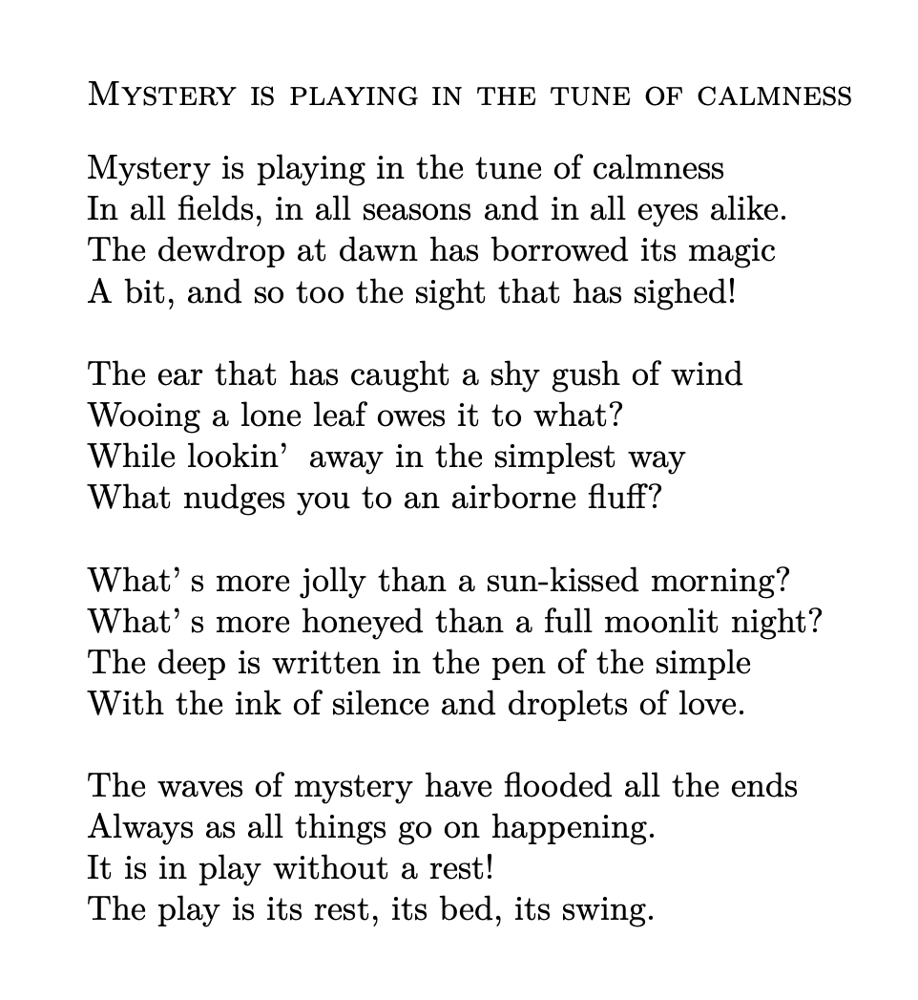
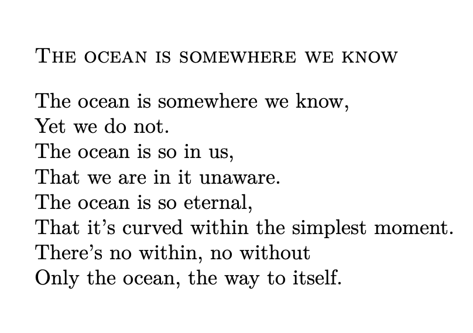

  

I love to read and write poetries, especially of experiential or philosophical nature, sometimes using allegories from nature and its wonders and motivations gleaned therefrom.

[Bartleby.com](https://www.bartleby.com/verse/) and [Poetseers.org](https://www.poetseers.org) are my favorite websites for poetries.

Some favorite verses are

- [Ode: Intimations of Immortality from Recollections of Early Childhood](https://www.bartleby.com/101/536.html) - William Wordsworth

- [O Solitude! if I must with thee dwell](https://www.bartleby.com/126/20.html) - John Keats

- [Eternity – William Blake](https://www.bartleby.com/333/129.html) - William Blake

- [Kali The Mother](http://www.ramakrishnavivekananda.info/vivekananda/volume_4/writings_poems/kali_the_mother.htm) - Swami Vivekananda

- [The Song of The Sannyasin](http://www.ramakrishnavivekananda.info/vivekananda/volume_4/writings_poems/the_song_of_the_sannyasin.htm) - Swami Vivekananda

- [Sakhar Proti (in Bengali)](http://www.ramakrishnavivekananda.info/vivekananda/volume_4/translation_poems/ben6208ato_a_friend.htm) - Swami Vivekananda  
[English translation](http://www.ramakrishnavivekananda.info/vivekananda/volume_4/translation_poems/to_a_friend.htm) 

- [Nachuk Tahate Shyama (in Bengali)](http://www.ramakrishnavivekananda.info/vivekananda/volume_4/translation_poems/ben6210and_let_shyama_dance_there.htm) - Swami Vivekananda

- [Extracts from Childe Harold’s Pilgrimage: Ocean](https://www.bartleby.com/337/985.html) - Lord Byron

- [To One Who Has Been Long in City Pent](https://www.bartleby.com/126/23.html) – John Keats

- [She Walks in Beauty](https://www.bartleby.com/205/26.html) - Lord Byron

- [Invictus](https://www.bartleby.com/103/7.html) - William Ernest Henley

- [The Road Not Taken](https://www.bartleby.com/119/1.html) - Robert Frost

- [I Wandered Lonely As a Cloud](https://www.bartleby.com/333/483.html) - William Wordsworth

- [All the world’s a stage, As You Like It, Act II, Scene VII](https://www.bartleby.com/70/2027.html) - William Shakespeare

- [Acquainted with the Night](https://en.wikipedia.org/wiki/Acquainted_with_the_Night) - Robert Frost

- [Ode to the West Wind](https://www.bartleby.com/101/610.html) - Percy Bysshe Shelley

- [By the Shore](https://www.bartleby.com/236/196.html) – Edward Carpenter

- [From The Solitary Reaper](https://www.bartleby.com/97/252.html) – William Wordsworth

- [A Dream Within a Dream](https://www.poetryfoundation.org/poems/52829/a-dream-within-a-dream) – Edgar Allan Poe

 

Here are few of my own works. Feel free to share but with proper credits.  

 

 From the Bottomless to Limitlessness   
[Link](https://americanvedantist.org/2020/issue-76/poems/) to online publication

